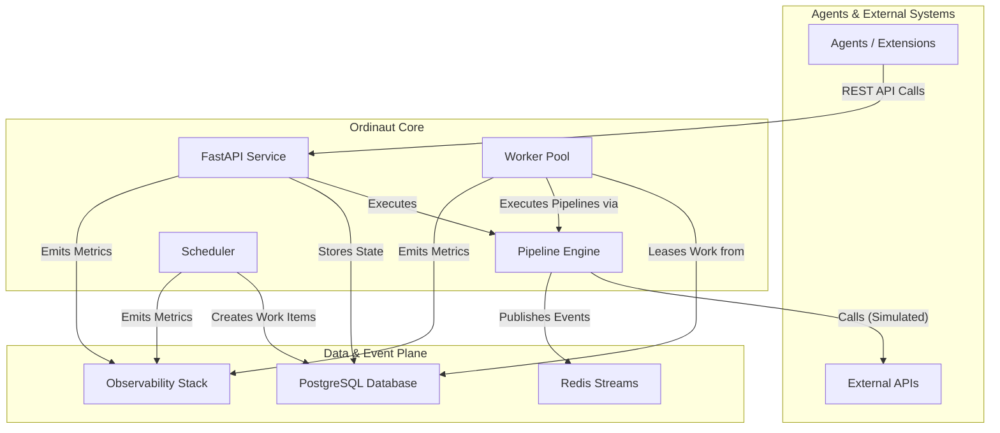

# Overview

Ordinaut is an enterprise-grade task scheduling API that serves as a powerful and reliable backend foundation. It is designed for extension and integration with other systems, including AI assistants, via its clean REST API.

The core philosophy is to provide a robust, production-ready system that handles the difficult, repetitive parts of automation—scheduling, state management, retries, and observability—allowing developers to build sophisticated workflows and integrations on top of it.

## The Core Problem Ordinaut Solves

Modern applications, including AI assistants, often need to perform actions on a reliable schedule or in response to events. For example, a user might want to tell an AI assistant: "Every weekday at 8am, check my calendar, get the weather, and send me a summary." While the AI can understand the intent, it needs a persistent, reliable backend to schedule, manage, and execute that workflow.

Ordinaut solves this by providing that backend. It is the engine that can be instructed—via its API—to run complex, recurring workflows with precision and reliability. While the core Ordinaut system is a "pure" task scheduler, it is designed to be extended, for instance by an "MCP Server" extension that would bridge the gap between an AI assistant's conversational interface and Ordinaut's execution capabilities.

## System Architecture

Ordinaut is built on a foundation of proven, production-grade technologies, ensuring reliability and scalability.

### Why This Architecture?

*   **FastAPI Service (The Gateway):** Provides a modern, secure, and well-documented REST API for agents and extensions to interact with the system. Its asynchronous nature allows for high-throughput handling of requests.
*   **PostgreSQL Database (The Brain):** Acts as the durable, single source of truth. Storing all tasks, schedules, and run histories in a powerful relational database like PostgreSQL guarantees ACID compliance and zero work loss, even in the event of a system failure.
*   **Worker Pool & `SKIP LOCKED` (The Engine):** This is the heart of Ordinaut's reliability. The `FOR UPDATE SKIP LOCKED` pattern is a canonical PostgreSQL feature for building robust job queues. It allows multiple workers to safely and concurrently lease work items from the `due_work` table without ever processing the same item twice. This enables horizontal scalability and high throughput.
*   **APScheduler (The Clock):** A battle-tested library for handling all time-based logic. It calculates *when* tasks should run and places them into the `due_work` queue for the workers. Its support for both cron and complex RRULEs provides immense scheduling flexibility.
*   **Redis Streams (The Nervous System):** Provides a high-performance, persistent event log. This decouples components and allows for powerful event-driven workflows, where tasks can be triggered by system events or external signals.
*   **Pipeline Engine (The Playbook):** Executes the declarative JSON/YAML workflows. It currently simulates tool calls, providing a robust framework for extensions to implement real tool integrations. By validating every step and managing the flow of data, it ensures that workflows are predictable, debuggable, and secure.
*   **Observability Stack (The Senses):** With integrated Prometheus metrics and structured logging, you have complete visibility into every aspect of the system's performance and behavior, which is critical for production operations.