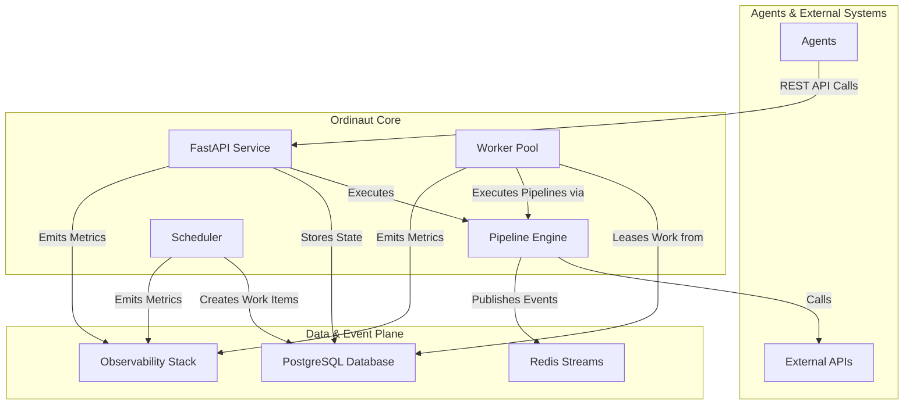

# Overview

Ordinaut is an enterprise-grade task scheduling API designed as the backend for AI assistant integrations via Model Context Protocol (MCP). It enables AI assistants like Claude Desktop and ChatGPT to manage complex recurring workflows through natural conversation.

The core philosophy is to handle the difficult, repetitive parts of automation—scheduling, state management, retries, and observability—while AI assistants focus on understanding user intent and translating it to scheduled actions.

## The Core Problem Ordinaut Solves

You want to tell an AI assistant: "Every weekday at 8am, check my calendar, get the weather, and send me a summary." The AI understands your intent perfectly, but it can't persist that instruction or reliably execute it in the future.

Ordinaut solves this by providing a persistent, reliable backend that AI assistants can use to schedule and manage complex recurring workflows. The AI handles the conversation, Ordinaut handles the execution.

## System Architecture

Ordinaut is built on a foundation of proven, production-grade technologies, ensuring reliability and scalability.

### Why This Architecture?

*   **FastAPI Service (The Gateway):** Provides a modern, secure, and well-documented REST API for agents to interact with the system. Its asynchronous nature allows for high-throughput handling of requests.
*   **PostgreSQL Database (The Brain):** Acts as the durable, single source of truth. Storing all tasks, schedules, and run histories in a powerful relational database like PostgreSQL guarantees ACID compliance and zero work loss, even in the event of a system failure.
*   **Worker Pool & `SKIP LOCKED` (The Engine):** This is the heart of Ordinaut's reliability. The `FOR UPDATE SKIP LOCKED` pattern is a canonical PostgreSQL feature for building robust job queues. It allows multiple workers to safely and concurrently lease work items from the `due_work` table without ever processing the same item twice. This enables horizontal scalability and high throughput.
*   **APScheduler (The Clock):** A battle-tested library for handling all time-based logic. It calculates *when* tasks should run and places them into the `due_work` queue for the workers. Its support for both cron and complex RRULEs provides immense scheduling flexibility.
*   **Redis Streams (The Nervous System):** Provides a high-performance, persistent event log. This decouples components and allows for powerful event-driven workflows, where tasks can be triggered by system events or external signals.
*   **Pipeline Engine (The Playbook):** Executes the declarative JSON/YAML workflows. By validating every step against a schema and managing the flow of data, it ensures that workflows are predictable, debuggable, and secure.
*   **Observability Stack (The Senses):** With integrated Prometheus metrics and structured logging, you have complete visibility into every aspect of the system's performance and behavior, which is critical for production operations.
