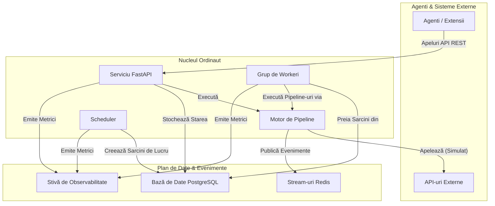

# Prezentare Generală

Ordinaut este un API de programare a sarcinilor de nivel enterprise, care servește ca o fundație backend puternică și fiabilă. Este conceput pentru extindere și integrare cu alte sisteme, inclusiv asistenți AI, prin intermediul API-ului său REST curat.

Filozofia de bază este de a oferi un sistem robust, gata de producție, care gestionează părțile dificile și repetitive ale automatizării—programarea, managementul stării, reîncercările și observabilitatea—permițând dezvoltatorilor să construiască fluxuri de lucru și integrări sofisticate deasupra acestuia.

## Problema Principală pe care o Rezolvă Ordinaut

Aplicațiile moderne, inclusiv asistenții AI, trebuie adesea să efectueze acțiuni conform unui program fiabil sau ca răspuns la evenimente. De exemplu, un utilizator ar putea dori să spună unui asistent AI: "În fiecare zi lucrătoare la 8 dimineața, verifică-mi calendarul, ia prognoza meteo și trimite-mi un rezumat." Deși AI-ul poate înțelege intenția, are nevoie de un backend persistent și fiabil pentru a programa, gestiona și executa acel flux de lucru.

Ordinaut rezolvă acest lucru oferind acel backend. Este motorul care poate fi instruit—prin API-ul său—să ruleze fluxuri de lucru complexe și recurente cu precizie și fiabilitate. Deși sistemul de bază Ordinaut este un planificator de sarcini "pur", este conceput pentru a fi extins, de exemplu, printr-o extensie "Server MCP" care ar face legătura între interfața conversațională a unui asistent AI și capacitățile de execuție ale Ordinaut.

## Arhitectura Sistemului

Ordinaut este construit pe o fundație de tehnologii dovedite, de nivel de producție, asigurând fiabilitate și scalabilitate.

### De Ce Această Arhitectură?

*   **Serviciu FastAPI (Gateway-ul):** Oferă un API REST modern, securizat și bine documentat pentru ca agenții și extensiile să interacționeze cu sistemul. Natura sa asincronă permite gestionarea unui volum mare de cereri.
*   **Bază de Date PostgreSQL (Creierul):** Acționează ca sursă unică și durabilă a adevărului. Stocarea tuturor sarcinilor, programărilor și istoricelor de rulare într-o bază de date relațională puternică precum PostgreSQL garantează conformitatea ACID și zero pierderi de lucru, chiar și în cazul unei defecțiuni a sistemului.
*   **Grup de Workeri & `SKIP LOCKED` (Motorul):** Aceasta este inima fiabilității Ordinaut. Modelul `FOR UPDATE SKIP LOCKED` este o caracteristică canonică a PostgreSQL pentru construirea de cozi de sarcini robuste. Permite mai multor workeri să preia sarcini în mod sigur și concurent din tabela `due_work` fără a procesa vreodată același element de două ori. Acest lucru permite scalabilitate orizontală și un debit ridicat.
*   **APScheduler (Ceasul):** O bibliotecă testată în luptă pentru gestionarea întregii logici temporale. Calculează *când* ar trebui să ruleze sarcinile și le plasează în coada `due_work` pentru workeri. Suportul său atât pentru cron, cât și pentru RRULE-uri complexe, oferă o flexibilitate imensă în programare.
*   **Stream-uri Redis (Sistemul Nervos):** Oferă un jurnal de evenimente persistent și de înaltă performanță. Acest lucru decuplează componentele și permite fluxuri de lucru puternice, bazate pe evenimente, unde sarcinile pot fi declanșate de evenimente de sistem sau semnale externe.
*   **Motor de Pipeline (Manualul de Joc):** Execută fluxurile de lucru declarative JSON/YAML. În prezent, simulează apelurile la instrumente, oferind un cadru robust pentru ca extensiile să implementeze integrări reale cu instrumente. Prin validarea fiecărui pas și gestionarea fluxului de date, se asigură că fluxurile de lucru sunt previzibile, depanabile și sigure.
*   **Stivă de Observabilitate (Simțurile):** Cu metrici Prometheus integrate și logging structurat, aveți vizibilitate completă asupra fiecărui aspect al performanței și comportamentului sistemului, ceea ce este critic pentru operațiunile de producție.