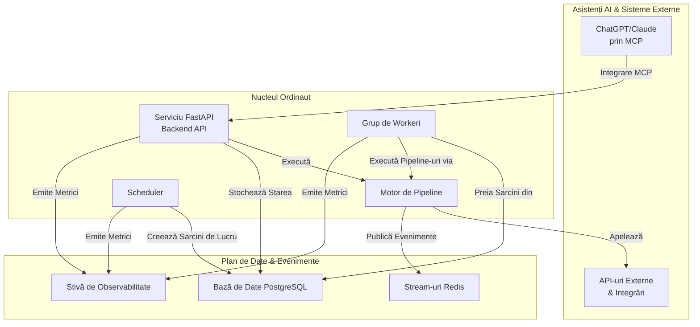

# Prezentare Generală

Ordinaut este un API backend de nivel enterprise pentru programarea sarcinilor, conceput pentru a fi integrat cu asistenții AI prin **Model Context Protocol (MCP)**. Oferă o infrastructură fiabilă pentru **timp, stare și disciplină**, permițând gestionarea în limbaj natural a fluxurilor de lucru complexe prin interfețe de chat.

Filozofia de bază este de a gestiona părțile dificile și repetitive ale automatizării—programarea, managementul stării, reîncercările și observabilitatea—astfel încât asistenții AI să se poată concentra pe conversația cu utilizatorii, în timp ce Ordinaut asigură execuția fiabilă în fundal.

## Problema Principală pe care o Rezolvă Ordinaut

Asistenții AI moderni (ChatGPT, Claude, Copilot) sunt excepționali la conversații, dar nu au capacitatea de a programa și executa sarcini în timp. De exemplu, ați putea cere unui asistent să "verifice vremea în fiecare dimineață la 8 AM și să-mi trimită un mesaj", dar nu poate executa această cerere în mod autonom în timp.

Ordinaut rezolvă această problemă servind ca backend fiabil pentru programarea sarcinilor, conectându-se cu asistenții AI prin Model Context Protocol (MCP). Utilizatorii pot cere sarcinilor complexe în limbaj natural prin chat, iar Ordinaut le execută conform programului stabilit.

## Arhitectura Sistemului

Ordinaut este construit pe o fundație de tehnologii dovedite, de nivel de producție, asigurând fiabilitate și scalabilitate.

### De Ce Această Arhitectură?

*   **Serviciu FastAPI (Backend API):** Oferă un API REST modern, securizat și bine documentat pentru ca asistenții AI să interacționeze cu sistemul prin MCP. Natura sa asincronă permite gestionarea unui volum mare de cereri de programare.
*   **Bază de Date PostgreSQL (Creierul):** Acționează ca sursă unică și durabilă a adevărului. Stocarea tuturor sarcinilor, programărilor și istoricelor de rulare într-o bază de date relațională puternică precum PostgreSQL garantează conformitatea ACID și zero pierderi de lucru, chiar și în cazul unei defecțiuni a sistemului.
*   **Grup de Workeri & `SKIP LOCKED` (Motorul):** Aceasta este inima fiabilității Ordinaut. Modelul `FOR UPDATE SKIP LOCKED` este o caracteristică canonică a PostgreSQL pentru construirea de cozi de sarcini robuste. Permite mai multor workeri să preia sarcini în mod sigur și concurent din tabela `due_work` fără a procesa vreodată același element de două ori. Acest lucru permite scalabilitate orizontală și un debit ridicat.
*   **APScheduler (Ceasul):** O bibliotecă testată în luptă pentru gestionarea întregii logici temporale. Calculează *când* ar trebui să ruleze sarcinile și le plasează în coada `due_work` pentru workeri. Suportul său atât pentru cron, cât și pentru RRULE-uri complexe, oferă o flexibilitate imensă în programare.
*   **Stream-uri Redis (Sistemul Nervos):** Oferă un jurnal de evenimente persistent și de înaltă performanță. Acest lucru decuplează componentele și permite fluxuri de lucru puternice, bazate pe evenimente, unde sarcinile pot fi declanșate de evenimente de sistem sau semnale externe.
*   **Motor de Pipeline (Manualul de Joc):** Execută fluxurile de lucru declarative JSON/YAML. Prin validarea fiecărui pas în raport cu o schemă și gestionarea fluxului de date, se asigură că fluxurile de lucru sunt previzibile, depanabile și sigure.
*   **Stivă de Observabilitate (Simțurile):** Cu metrici Prometheus integrate și logging structurat, aveți vizibilitate completă asupra fiecărui aspect al performanței și comportamentului sistemului, ceea ce este critic pentru operațiunile de producție.
