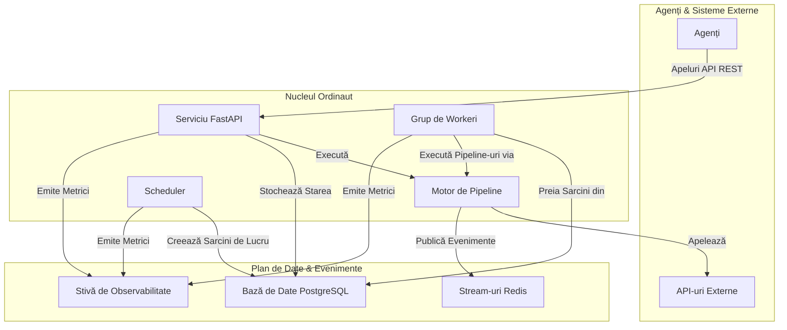

# Prezentare Generală

Ordinaut este un sistem de orchestratre conceput pentru a oferi agenților AI o coloană vertebrală comună pentru **timp, stare și disciplină**. Acesta transformă o colecție de agenți deconectați, cu un singur scop, într-un sistem coordonat și puternic, care poate executa fluxuri de lucru complexe în mod fiabil de-a lungul timpului.

Filozofia de bază este de a gestiona părțile dificile și repetitive ale automatizării—programarea, managementul stării, reîncercările și observabilitatea—astfel încât agenții dumneavoastră să se poată concentra pe sarcinile lor specializate.

## Problema Principală pe care o Rezolvă Ordinaut

Imaginați-vă că aveți mai mulți agenți AI: unul care vă poate citi e-mailurile, unul care poate verifica vremea și altul care vă poate gestiona calendarul. Singuri, aceștia sunt utili. Dar pentru a crea un sistem cu adevărat inteligent, aveți nevoie ca ei să lucreze împreună. De exemplu, pentru a-i face să pregătească automat un briefing de dimineață, au nevoie de un coordonator.

Ordinaut este acel coordonator. Acesta oferă cadrul pentru a defini, programa și monitoriza fluxurile de lucru care conectează abilitățile agenților dumneavoastră.

## Arhitectura Sistemului

Ordinaut este construit pe o fundație de tehnologii dovedite, de nivel de producție, asigurând fiabilitate și scalabilitate.

### De Ce Această Arhitectură?

*   **Serviciu FastAPI (Gateway-ul):** Oferă un API REST modern, securizat și bine documentat pentru ca agenții să interacționeze cu sistemul. Natura sa asincronă permite gestionarea unui volum mare de cereri.
*   **Bază de Date PostgreSQL (Creierul):** Acționează ca sursă unică și durabilă a adevărului. Stocarea tuturor sarcinilor, programărilor și istoricelor de rulare într-o bază de date relațională puternică precum PostgreSQL garantează conformitatea ACID și zero pierderi de lucru, chiar și în cazul unei defecțiuni a sistemului.
*   **Grup de Workeri & `SKIP LOCKED` (Motorul):** Aceasta este inima fiabilității Ordinaut. Modelul `FOR UPDATE SKIP LOCKED` este o caracteristică canonică a PostgreSQL pentru construirea de cozi de sarcini robuste. Permite mai multor workeri să preia sarcini în mod sigur și concurent din tabela `due_work` fără a procesa vreodată același element de două ori. Acest lucru permite scalabilitate orizontală și un debit ridicat.
*   **APScheduler (Ceasul):** O bibliotecă testată în luptă pentru gestionarea întregii logici temporale. Calculează *când* ar trebui să ruleze sarcinile și le plasează în coada `due_work` pentru workeri. Suportul său atât pentru cron, cât și pentru RRULE-uri complexe, oferă o flexibilitate imensă în programare.
*   **Stream-uri Redis (Sistemul Nervos):** Oferă un jurnal de evenimente persistent și de înaltă performanță. Acest lucru decuplează componentele și permite fluxuri de lucru puternice, bazate pe evenimente, unde sarcinile pot fi declanșate de evenimente de sistem sau semnale externe.
*   **Motor de Pipeline (Manualul de Joc):** Execută fluxurile de lucru declarative JSON/YAML. Prin validarea fiecărui pas în raport cu o schemă și gestionarea fluxului de date, se asigură că fluxurile de lucru sunt previzibile, depanabile și sigure.
*   **Stivă de Observabilitate (Simțurile):** Cu metrici Prometheus integrate și logging structurat, aveți vizibilitate completă asupra fiecărui aspect al performanței și comportamentului sistemului, ceea ce este critic pentru operațiunile de producție.
