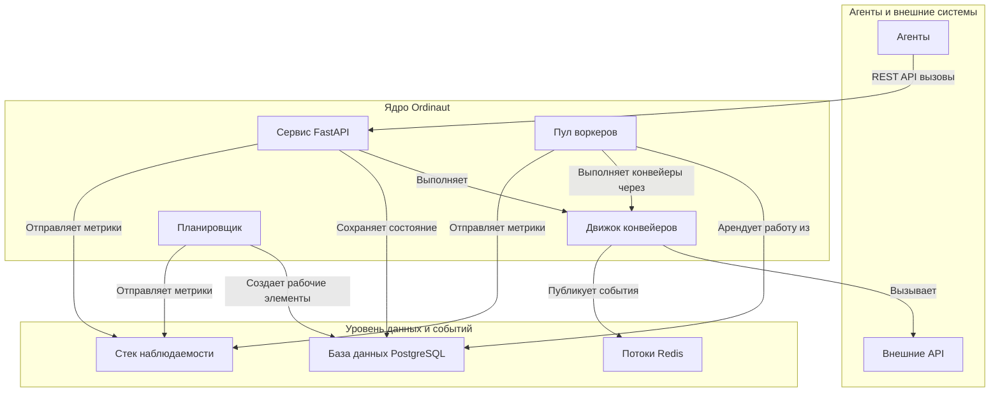

# Обзор

Ordinaut — это система оркестровки, предназначенная для обеспечения общей основы для ваших AI-агентов в вопросах **времени, состояния и дисциплины**. Она превращает набор разрозненных, узкоспециализированных агентов в скоординированную, мощную систему, способную надежно выполнять сложные рабочие процессы с течением времени.

Основная философия заключается в том, чтобы взять на себя сложные, повторяющиеся части автоматизации — планирование, управление состоянием, повторные попытки и наблюдаемость — чтобы ваши агенты могли сосредоточиться на своих специализированных задачах.

## Основная проблема, которую решает Ordinaut

Представьте, что у вас есть несколько AI-агентов: один может читать вашу электронную почту, другой — проверять погоду, а третий — управлять вашим календарем. Сами по себе они полезны. Но чтобы создать действительно интеллектуальную систему, необходимо, чтобы они работали вместе. Например, чтобы они автоматически готовили утренний брифинг, им нужен координатор.

Ordinaut и есть этот координатор. Он предоставляет фреймворк для определения, планирования и мониторинга рабочих процессов, которые объединяют возможности ваших агентов.

## Архитектура системы

Ordinaut построен на основе проверенных, готовых к промышленной эксплуатации технологий, обеспечивающих надежность и масштабируемость.

### Почему именно такая архитектура?

*   **Сервис FastAPI (Шлюз):** Предоставляет современный, безопасный и хорошо документированный REST API для взаимодействия агентов с системой. Его асинхронная природа позволяет обрабатывать большое количество запросов.
*   **База данных PostgreSQL (Мозг):** Действует как надежный, единственный источник истины. Хранение всех задач, расписаний и истории запусков в мощной реляционной базе данных, такой как PostgreSQL, гарантирует соответствие требованиям ACID и отсутствие потерь работы даже в случае сбоя системы.
*   **Пул воркеров и `SKIP LOCKED` (Движок):** Это сердце надежности Ordinaut. Паттерн `FOR UPDATE SKIP LOCKED` является канонической функцией PostgreSQL для создания надежных очередей заданий. Он позволяет нескольким воркерам безопасно и одновременно арендовать рабочие элементы из таблицы `due_work`, не обрабатывая один и тот же элемент дважды. Это обеспечивает горизонтальную масштабируемость и высокую пропускную способность.
*   **APScheduler (Часы):** Проверенная в боях библиотека для обработки всей временной логики. Она вычисляет, *когда* должны выполняться задачи, и помещает их в очередь `due_work` для воркеров. Поддержка как cron, так и сложных правил RRULE обеспечивает огромную гибкость планирования.
*   **Потоки Redis (Нервная система):** Обеспечивают высокопроизводительный, постоянный журнал событий. Это разделяет компоненты и позволяет создавать мощные, управляемые событиями рабочие процессы, где задачи могут запускаться системными событиями или внешними сигналами.
*   **Движок конвейеров (План действий):** Выполняет декларативные рабочие процессы в формате JSON/YAML. Проверяя каждый шаг по схеме и управляя потоком данных, он обеспечивает предсказуемость, отлаживаемость и безопасность рабочих процессов.
*   **Стек наблюдаемости (Органы чувств):** Благодаря встроенным метрикам Prometheus и структурированному логированию у вас есть полный обзор каждого аспекта производительности и поведения системы, что критически важно для производственных операций.
