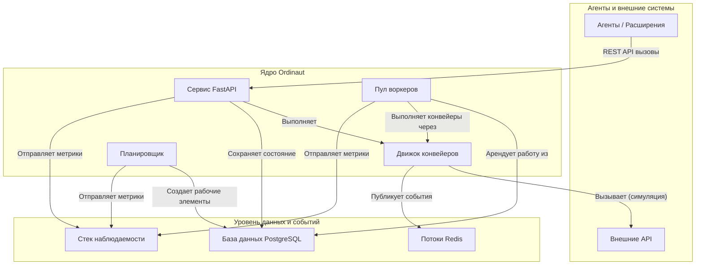

# Обзор

Ordinaut — это API для планирования задач корпоративного уровня, который служит мощной и надежной серверной основой. Он предназначен для расширения и интеграции с другими системами, включая AI-помощников, через его чистый REST API.

Основная философия заключается в предоставлении надежной, готовой к производству системы, которая справляется со сложными, повторяющимися частями автоматизации — планированием, управлением состоянием, повторными попытками и наблюдаемостью, — позволяя разработчикам создавать сложные рабочие процессы и интеграции поверх нее.

## Основная проблема, которую решает Ordinaut

Современным приложениям, включая AI-помощников, часто необходимо выполнять действия по надежному расписанию или в ответ на события. Например, пользователь может захотеть сказать AI-помощнику: "Каждый будний день в 8 утра проверяй мой календарь, узнавай погоду и присылай мне сводку". Хотя ИИ может понять намерение, ему нужен постоянный, надежный бэкэнд для планирования, управления и выполнения этого рабочего процесса.

Ordinaut решает эту проблему, предоставляя этот бэкэнд. Это движок, которому можно дать указание — через его API — выполнять сложные, повторяющиеся рабочие процессы с точностью и надежностью. Хотя ядро системы Ordinaut является "чистым" планировщиком задач, оно предназначено для расширения, например, с помощью расширения "MCP Server", которое устранит разрыв между разговорным интерфейсом AI-помощника и возможностями выполнения Ordinaut.

## Архитектура системы

Ordinaut построен на основе проверенных, готовых к промышленной эксплуатации технологий, обеспечивающих надежность и масштабируемость.

### Почему именно такая архитектура?

*   **Сервис FastAPI (Шлюз):** Предоставляет современный, безопасный и хорошо документированный REST API для взаимодействия агентов и расширений с системой. Его асинхронная природа позволяет обрабатывать большое количество запросов.
*   **База данных PostgreSQL (Мозг):** Действует как надежный, единственный источник истины. Хранение всех задач, расписаний и истории запусков в мощной реляционной базе данных, такой как PostgreSQL, гарантирует соответствие требованиям ACID и отсутствие потерь работы даже в случае сбоя системы.
*   **Пул воркеров и `SKIP LOCKED` (Движок):** Это сердце надежности Ordinaut. Паттерн `FOR UPDATE SKIP LOCKED` является канонической функцией PostgreSQL для создания надежных очередей заданий. Он позволяет нескольким воркерам безопасно и одновременно арендовать рабочие элементы из таблицы `due_work`, не обрабатывая один и тот же элемент дважды. Это обеспечивает горизонтальную масштабируемость и высокую пропускную способность.
*   **APScheduler (Часы):** Проверенная в боях библиотека для обработки всей временной логики. Она вычисляет, *когда* должны выполняться задачи, и помещает их в очередь `due_work` для воркеров. Поддержка как cron, так и сложных правил RRULE обеспечивает огромную гибкость планирования.
*   **Потоки Redis (Нервная система):** Обеспечивают высокопроизводительный, постоянный журнал событий. Это разделяет компоненты и позволяет создавать мощные, управляемые событиями рабочие процессы, где задачи могут запускаться системными событиями или внешними сигналами.
*   **Движок конвейеров (План действий):** Выполняет декларативные рабочие процессы в формате JSON/YAML. В настоящее время он имитирует вызовы инструментов, предоставляя надежную основу для реализации реальных интеграций инструментов в расширениях. Проверяя каждый шаг и управляя потоком данных, он обеспечивает предсказуемость, отлаживаемость и безопасность рабочих процессов.
*   **Стек наблюдаемости (Органы чувств):** Благодаря встроенным метрикам Prometheus и структурированному логированию у вас есть полный обзор каждого аспекта производительности и поведения системы, что критически важно для производственных операций.