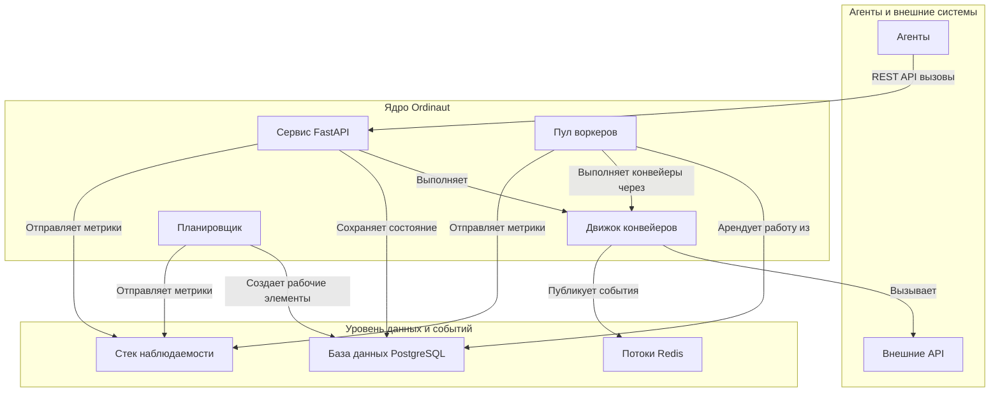

# Обзор

Ordinaut — это enterprise-grade API для планирования задач с поддержкой RRULE, выполнением конвейеров и полной наблюдаемостью. Система специально создана в качестве backend для интеграций AI-помощников через **Model Context Protocol (MCP)**.

Основная философия заключается в том, чтобы обеспечить надежное выполнение сложных повторяющихся рабочих процессов, которыми пользователи могут управлять через чат-интерфейсы на естественном языке. AI-помощники обрабатывают диалог с пользователем, а Ordinaut гарантирует точное планирование и безошибочное выполнение задач.

## Основная проблема, которую решает Ordinaut

AI-помощники отлично справляются с разовыми задачами и ответами, но им трудно управлять сложными повторяющимися рабочими процессами. Пользователи хотят говорить: "Каждое утро в 8:00 отправляй мне краткую сводку погоды и календаря", а не вспоминать об этом каждый день.

Ordinaut решает эту проблему, предоставляя AI-помощникам (через MCP) возможность создавать, планировать и управлять сложными рабочими процессами. Пользователи могут описывать свои потребности в автоматизации на естественном языке, а помощник переводит это в надежные, постоянные задачи в Ordinaut.

## Архитектура системы

Ordinaut построен на основе проверенных, готовых к промышленной эксплуатации технологий, обеспечивающих надежность и масштабируемость.

### Почему именно такая архитектура?

*   **Сервис FastAPI (Шлюз):** Предоставляет современный, безопасный и хорошо документированный REST API для взаимодействия AI-помощников через MCP с системой. Его асинхронная природа позволяет обрабатывать большое количество запросов от чат-интерфейсов.
*   **База данных PostgreSQL (Мозг):** Действует как надежный, единственный источник истины. Хранение всех задач, расписаний и истории запусков в мощной реляционной базе данных, такой как PostgreSQL, гарантирует соответствие требованиям ACID и отсутствие потерь работы даже в случае сбоя системы.
*   **Пул воркеров и `SKIP LOCKED` (Движок):** Это сердце надежности Ordinaut. Паттерн `FOR UPDATE SKIP LOCKED` является канонической функцией PostgreSQL для создания надежных очередей заданий. Он позволяет нескольким воркерам безопасно и одновременно арендовать рабочие элементы из таблицы `due_work`, не обрабатывая один и тот же элемент дважды. Это обеспечивает горизонтальную масштабируемость и высокую пропускную способность.
*   **APScheduler (Часы):** Проверенная в боях библиотека для обработки всей временной логики. Она вычисляет, *когда* должны выполняться задачи, и помещает их в очередь `due_work` для воркеров. Поддержка как cron, так и сложных правил RRULE обеспечивает огромную гибкость планирования.
*   **Потоки Redis (Нервная система):** Обеспечивают высокопроизводительный, постоянный журнал событий. Это разделяет компоненты и позволяет создавать мощные, управляемые событиями рабочие процессы, где задачи могут запускаться системными событиями или внешними сигналами.
*   **Движок конвейеров (План действий):** Выполняет декларативные рабочие процессы в формате JSON/YAML. Проверяя каждый шаг по схеме и управляя потоком данных, он обеспечивает предсказуемость, отлаживаемость и безопасность рабочих процессов.
*   **Стек наблюдаемости (Органы чувств):** Благодаря встроенным метрикам Prometheus и структурированному логированию у вас есть полный обзор каждого аспекта производительности и поведения системы, что критически важно для производственных операций.
