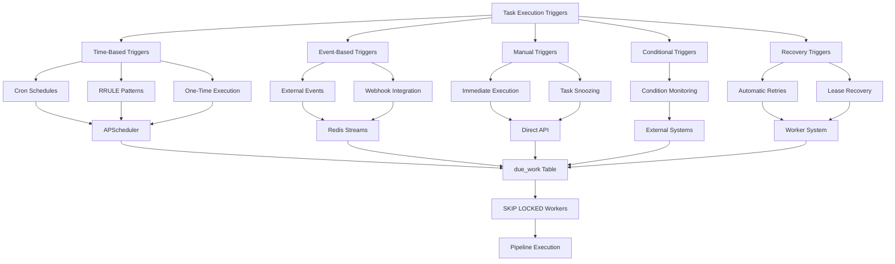
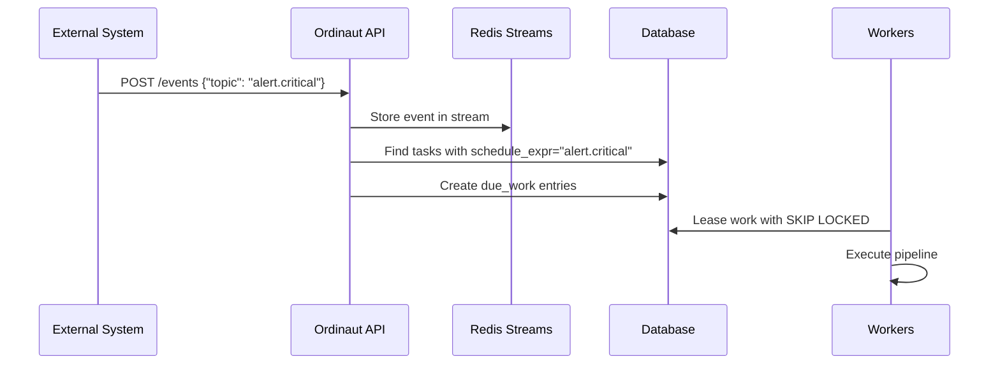
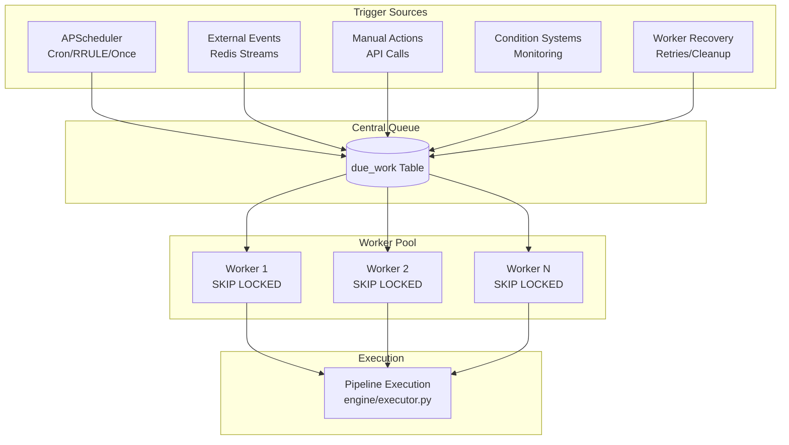

# Core Concepts

Understanding these core concepts is key to using Ordinaut effectively. They form the building blocks of any automation you create.

---

### Agent

An **Agent** is an actor in the system, identified by a unique ID (UUID) and an authentication token. Agents are the owners of tasks and the initiators of actions. You can create different agents for different roles (e.g., a `reporting-agent`, a `data-processing-agent`) and grant them specific permissions (scopes) to control what they are allowed to do.

---

### Task

The **Task** is the fundamental unit of work in Ordinaut. It is a persistent object that brings together the *what*, *when*, and *how* of an automation.

A Task object contains:
- **Metadata:** A `title` and `description` for human readability.
- **Schedule:** Defines *when* the task should run.
- **Pipeline:** Defines the sequence of steps to execute.
- **Execution Policy:** Defines *how* the task should run, including its `priority`, `max_retries`, and `concurrency_key`.
- **Ownership:** The `created_by` field links the task to an Agent.

---

### Task Execution Triggers

Ordinaut provides **5 distinct trigger mechanisms** that determine when tasks execute. Understanding these triggers is crucial for building reliable automation workflows.

!!! tip "Interactive Diagrams"
    The diagrams below are **interactive** - you can zoom in/out with your mouse wheel and **click and drag** to pan around large diagrams. This is especially helpful for exploring the detailed architecture flows.

#### 1. Time-Based Triggers (APScheduler-Driven)

**Cron Triggers** (`schedule_kind: "cron"`):
- **Purpose**: Traditional Unix cron scheduling for recurring tasks
- **Engine**: APScheduler with PostgreSQL job store
- **Example**: `"0 9 * * 1-5"` (Every weekday at 9:00 AM)
- **Use Cases**: Daily backups, weekly reports, regular health checks

**RRULE Triggers** (`schedule_kind: "rrule"`):
- **Purpose**: Complex RFC-5545 recurring patterns with timezone support
- **Engine**: APScheduler + dateutil.rrule for next occurrence calculation
- **Example**: `"FREQ=MONTHLY;BYDAY=-1FR;BYHOUR=17"` (Last Friday of month at 5 PM)
- **Use Cases**: Calendar-aware scheduling, business day logic, holiday handling

**One-Time Triggers** (`schedule_kind: "once"`):
- **Purpose**: Execute at specific future datetime
- **Engine**: APScheduler DateTrigger
- **Example**: `"2025-12-25T09:00:00+02:00"` (Christmas morning)
- **Use Cases**: Scheduled announcements, deadline reminders, maintenance windows

#### 2. Event-Based Triggers

**External Event Triggers** (`schedule_kind: "event"`):
- **Purpose**: React to external system events (webhooks, notifications, alerts)
- **Engine**: Redis Streams for durable event processing
- **API**: `POST /events {"topic": "github.push", "payload": {...}}`
- **Matching**: Tasks with `schedule_expr` matching the event topic are triggered
- **Use Cases**: CI/CD pipelines, alert processing, webhook handling

#### 3. Manual/API Triggers

**Immediate Execution**:
- **API**: `POST /tasks/{task_id}/run_now`
- **Purpose**: Human-triggered or programmatic immediate execution
- **Process**: Direct `due_work` insertion bypassing APScheduler
- **Use Cases**: Testing, emergency execution, manual operations

**Task Snoozing**:
- **API**: `POST /tasks/{task_id}/snooze`
- **Purpose**: Delay scheduled execution with reason tracking
- **Process**: SQL UPDATE to modify `run_at` timestamp
- **Use Cases**: Maintenance windows, temporary delays, conflict resolution

#### 4. Conditional Triggers

**Condition-Based Tasks** (`schedule_kind: "condition"`):
- **Purpose**: Execute when external conditions are met
- **Engine**: External monitoring systems evaluate conditions
- **Examples**: Disk space < 10%, error rate > 5%, temperature > 30°C
- **Process**: Condition evaluators trigger via API when thresholds met

#### 5. Recovery Triggers

**Automatic Retries**:
- **Engine**: Worker failure handling with exponential backoff
- **Process**: Failed tasks create new `due_work` entries with delay
- **Configuration**: `max_retries`, `backoff_strategy` in task definition

**Lease Recovery**:
- **Engine**: Coordinator cleanup of expired worker leases
- **Process**: Reset `locked_until` to NULL for crashed worker leases
- **Purpose**: Ensure no work is lost due to worker failures

#### Complete Execution Flow

#### Why This Architecture Works

**Decoupled Design**: APScheduler handles *when*, workers handle *what*
- Scheduler crashes don't affect execution of already-queued work
- Worker crashes don't affect future scheduling
- Each component scales independently

**Event-Driven Flexibility**: External systems trigger complex workflows
- Webhook integrations (GitHub, Slack, monitoring systems)
- Real-time processing of alerts and notifications
- Human-triggered operations through APIs

**Guaranteed Execution**: SKIP LOCKED ensures exactly-once processing
- No duplicate work under any failure scenario
- Fair work distribution across workers
- Immediate availability without polling delays

**Comprehensive Coverage**: Every trigger scenario supported
- Time-based: covers all scheduling needs
- Event-based: covers all reactive needs
- Manual: covers all human/API needs
- Recovery: covers all failure scenarios

!!! tip "Timezones are Important"
    All time-based schedules are timezone-aware. Always specify a `timezone` (e.g., `Europe/Chisinau`) in your task definition to ensure schedules trigger at the correct local time, especially across Daylight Saving Time changes.

---

### Pipeline

The **Pipeline** is the heart of a task—it's the declarative definition of the work to be done. It consists of an ordered list of **Steps**.

- **Data Flow:** The output of one step can be used as the input for subsequent steps, allowing you to chain operations together.
- **Parameters:** Pipelines can receive initial data from the `payload.params` object in the task definition.
- **Conditional Logic:** Steps can be executed conditionally based on the output of previous steps.

---

### Step

A **Step** is a single, atomic action within a pipeline. Each step has several key properties:

- `id`: A unique name for the step within the pipeline.
- `uses`: The address of the **Tool** to be executed (e.g., `telegram.send_message`).
- `with`: An object containing the arguments to pass to the tool. This is where you can use template variables.
- `save_as`: A name to store the step's output under. This makes the result available to later steps via the `steps` context.
- `if`: A conditional expression that determines whether the step should run.

---

### Tool

A **Tool** is a registered, reusable capability that can be called from a pipeline step. Each tool has a strictly defined **input schema** and **output schema**, which ensures that data flowing through the pipeline is predictable and valid. Ordinaut can be extended with tools that connect to any external API or service.

---

### Run

A **Run** is a record of a single execution of a task's pipeline. Every time a task is triggered by its schedule or an event, a new Run object is created. This object tracks:

- The start and end time of the execution.
- The final status (`success` or `failure`).
- The number of retry `attempt`s.
- The detailed `output` of the pipeline, including the results of each step.
- Any `error` that occurred.

This provides a complete, auditable history of every action the system takes.

---

### `due_work` Queue

This is an internal database table that acts as the job queue. The **Scheduler**'s only job is to calculate the next run time for each task and insert a corresponding row into the `due_work` table. The **Workers** then poll this table, safely lease jobs using `FOR UPDATE SKIP LOCKED`, and execute them. This decoupling of scheduling from execution is fundamental to Ordinaut's reliability and scalability.