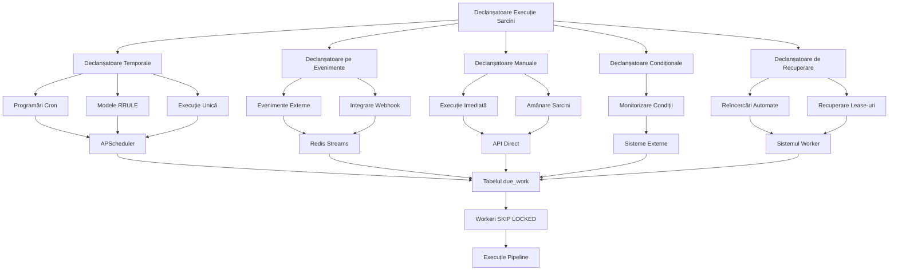
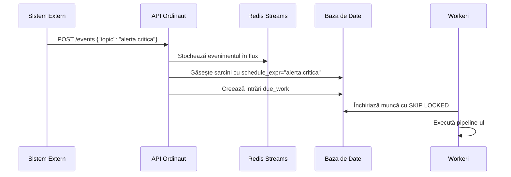
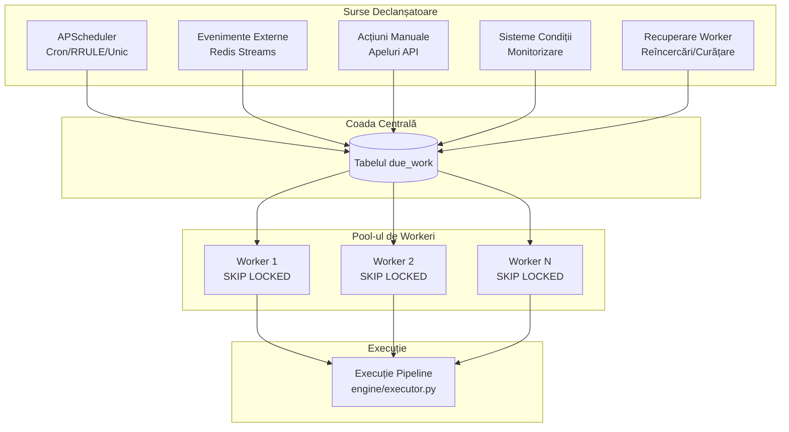

# Concepte de Bază

Înțelegerea acestor concepte de bază este esențială pentru a utiliza eficient Ordinaut. Ele formează blocurile de construcție ale oricărei automatizări pe care o creați.

---

### Agent

Un **Agent** este un actor în sistem, identificat printr-un ID unic (UUID) și un token de autentificare. Agenții sunt de obicei asistenți AI (ChatGPT, Claude, Copilot) care se conectează prin Model Context Protocol (MCP) pentru a crea și gestiona sarcini în numele utilizatorilor. Fiecare agent are permisiuni specifice (scopuri) pentru a controla ce operații sunt permise.

---

### Sarcină (Task)

**Sarcina** este unitatea fundamentală de lucru în Ordinaut. Este un obiect persistent care reunește *ce*, *când* și *cum* se realizează o automatizare.

Un obiect Sarcină conține:
- **Metadate:** Un `titlu` și o `descriere` pentru lizibilitate umană.
- **Programare (Schedule):** Definește *când* ar trebui să ruleze sarcina.
- **Pipeline:** Definește secvența de pași de executat.
- **Politică de Execuție:** Definește *cum* ar trebui să ruleze sarcina, inclusiv `prioritatea`, `reîncercările maxime` și `cheia de concurență`.
- **Proprietate:** Câmpul `created_by` leagă sarcina de un Agent.

---

### Declanșatoare de Execuție a Sarcinilor

Ordinaut oferă **5 mecanisme distincte de declanșare** care determină când se execută sarcinile. Înțelegerea acestor declanșatoare este crucială pentru construirea fluxurilor de automatizare fiabile.

#### 1. Declanșatoare Temporale (APScheduler)

**Declanșatoare Cron** (`schedule_kind: "cron"`):
- **Scop**: Programarea tradițională Unix cron pentru sarcini recurente
- **Motor**: APScheduler cu magazin de joburi PostgreSQL
- **Exemplu**: `"0 9 * * 1-5"` (În fiecare zi lucrătoare la 9:00 AM)
- **Cazuri de utilizare**: Backup-uri zilnice, rapoarte săptămânale, verificări regulate de sănătate

**Declanșatoare RRULE** (`schedule_kind: "rrule"`):
- **Scop**: Modele complexe recurente RFC-5545 cu suport pentru fus orar
- **Motor**: APScheduler + dateutil.rrule pentru calculul următoarei apariții
- **Exemplu**: `"FREQ=MONTHLY;BYDAY=-1FR;BYHOUR=17"` (Ultima vineri a lunii la 17:00)
- **Cazuri de utilizare**: Programare conștientă de calendar, logică zile lucrătoare, gestionare sărbători

**Declanșatoare Unice** (`schedule_kind: "once"`):
- **Scop**: Execută la o dată și oră specifică în viitor
- **Motor**: APScheduler DateTrigger
- **Exemplu**: `"2025-12-25T09:00:00+02:00"` (Dimineața de Crăciun)
- **Cazuri de utilizare**: Anunțuri programate, memento-uri de deadline, ferestre de mentenanță

#### 2. Declanșatoare pe Evenimente

**Declanșatoare Evenimente Externe** (`schedule_kind: "event"`):
- **Scop**: Reacționează la evenimente din sistemele externe (webhook-uri, notificări, alerte)
- **Motor**: Redis Streams pentru procesarea durabilă a evenimentelor
- **API**: `POST /events {"topic": "github.push", "payload": {...}}`
- **Potrivire**: Sarcinile cu `schedule_expr` care se potrivesc cu topicul evenimentului sunt declanșate
- **Cazuri de utilizare**: Pipeline-uri CI/CD, procesarea alertelor, gestionarea webhook-urilor

#### 3. Declanșatoare Manuale/API

**Execuție Imediată**:
- **API**: `POST /tasks/{task_id}/run_now`
- **Scop**: Execuție imediată declanșată de om sau programatic
- **Proces**: Inserție directă `due_work` ocolind APScheduler
- **Cazuri de utilizare**: Testare, execuție de urgență, operații manuale

**Amânarea Sarcinilor**:
- **API**: `POST /tasks/{task_id}/snooze`
- **Scop**: Întârzierea execuției programate cu urmărirea motivului
- **Proces**: SQL UPDATE pentru a modifica timestamp-ul `run_at`
- **Cazuri de utilizare**: Ferestre de mentenanță, întârzieri temporare, rezolvarea conflictelor

#### 4. Declanșatoare Condiționale

**Sarcini Bazate pe Condiții** (`schedule_kind: "condition"`):
- **Scop**: Execută când condițiile externe sunt îndeplinite
- **Motor**: Sistemele externe de monitorizare evaluează condițiile
- **Exemple**: Spațiu disc < 10%, rata de eroare > 5%, temperatura > 30°C
- **Proces**: Evaluatorii de condiții declanșează prin API când pragurile sunt atinse

#### 5. Declanșatoare de Recuperare

**Reîncercări Automate**:
- **Motor**: Gestionarea eșecurilor workerilor cu backoff exponențial
- **Proces**: Sarcinile eșuate creează noi intrări `due_work` cu întârziere
- **Configurare**: `max_retries`, `backoff_strategy` în definiția sarcinii

**Recuperarea Lease-urilor**:
- **Motor**: Curățarea coordinatorului pentru lease-urile expirate ale workerilor
- **Proces**: Resetează `locked_until` la NULL pentru lease-urile workerilor căzuți
- **Scop**: Asigură că nicio muncă nu se pierde din cauza eșecurilor workerilor

#### Fluxul Complet de Execuție

#### De Ce Funcționează Această Arhitectură

**Design Decuplat**: APScheduler gestionează *când*, workerii gestionează *ce*
- Căderile schedulerului nu afectează execuția muncii deja în coadă
- Căderile workerilor nu afectează programarea viitoare
- Fiecare componentă se scalează independent

**Flexibilitate Orientată pe Evenimente**: Sistemele externe declanșează fluxuri complexe
- Integrări webhook (GitHub, Slack, sisteme de monitorizare)
- Procesarea în timp real a alertelor și notificărilor
- Operații declanșate de om prin API-uri

**Execuție Garantată**: SKIP LOCKED asigură procesarea exactă o dată
- Nicio muncă duplicată în orice scenariu de eșec
- Distribuție echitabilă a muncii între workeri
- Disponibilitate imediată fără întârzieri de polling

**Acoperire Comprehensivă**: Fiecare scenariu de declanșare suportat
- Bazat pe timp: acoperă toate nevoile de programare
- Bazat pe evenimente: acoperă toate nevoile reactive
- Manual: acoperă toate nevoile umane/API
- Recuperare: acoperă toate scenariile de eșec

!!! tip "Fusurile Orare sunt Importante"
    Toate programările bazate pe timp sunt conștiente de fusul orar. Specificați întotdeauna un `timezone` (de exemplu, `Europe/Chisinau`) în definiția sarcinii pentru a vă asigura că programările se declanșează la ora locală corectă, în special în timpul schimbărilor de oră de vară.

---

### Pipeline

**Pipeline-ul** este inima unei sarcini—este definiția declarativă a muncii care trebuie efectuată. Acesta constă dintr-o listă ordonată de **Pași**.

- **Flux de Date:** Rezultatul unui pas poate fi folosit ca intrare pentru pașii ulteriori, permițându-vă să înlănțuiți operațiunile.
- **Parametri:** Pipeline-urile pot primi date inițiale din obiectul `payload.params` din definiția sarcinii.
- **Logică Condiționată:** Pașii pot fi executați condiționat pe baza rezultatului pașilor anteriori.

---

### Pas (Step)

Un **Pas** este o acțiune unică, atomică, în cadrul unui pipeline. Fiecare pas are mai multe proprietăți cheie:

- `id`: Un identificator unic pentru pas în cadrul pipeline-ului.
- `uses`: Adresa **Instrumentului (Tool)** care trebuie executat (de exemplu, `telegram.send_message`).
- `with`: Un obiect care conține argumentele de transmis instrumentului. Această secțiune suportă variabile șablon.
- `save_as`: Un nume sub care va fi salvat rezultatul pasului. Acest lucru face ca rezultatul să fie disponibil pentru pașii ulteriori prin contextul `steps`.
- `if`: O expresie condiționată care determină dacă pasul ar trebui să ruleze.

---

### Instrument (Tool)

Un **Instrument** este o capacitate înregistrată, reutilizabilă, care poate fi apelată dintr-un pas de pipeline. Fiecare instrument are o **schemă de intrare (input schema)** și o **schemă de ieșire (output schema)** strict definite, ceea ce asigură că datele care circulă prin pipeline sunt previzibile și valide. Ordinaut poate fi extins cu instrumente care se conectează la orice API sau serviciu extern.

---

### Rulare (Run)

O **Rulare** este o înregistrare a unei singure execuții a pipeline-ului unei sarcini. De fiecare dată când o sarcină este declanșată de programarea sa sau de un eveniment, se creează un nou obiect Rulare. Acest obiect urmărește:

- Ora de începere și de sfârșit a execuției.
- Starea finală (`succes` sau `eșec`).
- Numărul de `încercări` de reexecutare.
- `Rezultatul` detaliat al pipeline-ului, inclusiv rezultatele fiecărui pas.
- Orice `eroare` care a apărut.

Acest lucru oferă un istoric complet și auditabil al fiecărei acțiuni pe care o întreprinde sistemul.

---

### Coada `due_work`

Aceasta este o tabelă internă a bazei de date care acționează ca o coadă de sarcini. Singura treabă a **Scheduler-ului** este să calculeze următoarea oră de rulare pentru fiecare sarcină și să insereze un rând corespunzător în tabela `due_work`. **Workerii** interoghează apoi această tabelă, preiau în siguranță sarcini folosind `FOR UPDATE SKIP LOCKED` și le execută. Această decuplare a programării de execuție este fundamentală pentru fiabilitatea și scalabilitatea Ordinaut.
