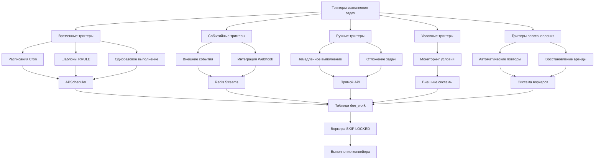
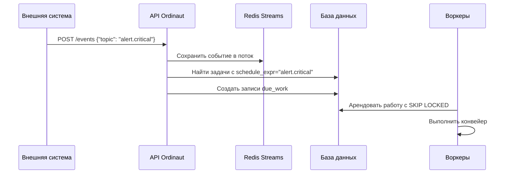
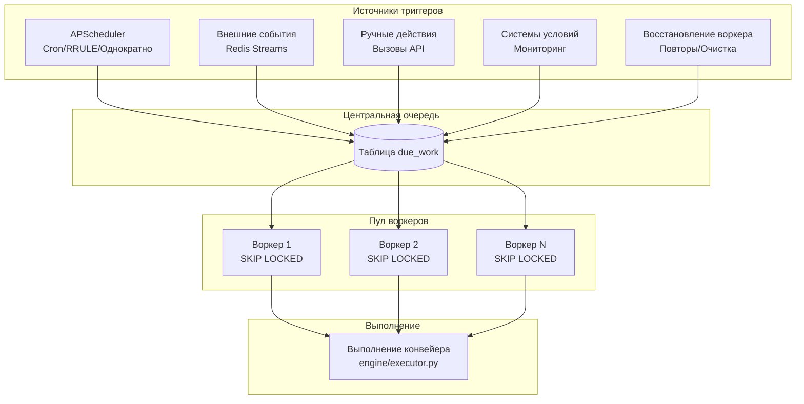

# Основные концепции

Понимание этих основных концепций является ключом к эффективному использованию Ordinaut. Они составляют строительные блоки любой создаваемой вами автоматизации.

---

### Агент

**Агент** — это действующее лицо в системе, представляющее AI-помощника, подключенного через MCP. Каждый агент идентифицируется уникальным ID (UUID) и токеном аутентификации. Агенты владеют задачами и инициируют действия от имени пользователей через чат-интерфейсы. Вы можете создавать разных агентов для разных AI-помощников (например, `claude-assistant`, `gpt-assistant`) и предоставлять им определенные разрешения (области действия) для контроля над тем, что им разрешено делать.

---

### Задача (Task)

**Задача** — это фундаментальная единица работы в Ordinaut. Это постоянный объект, который объединяет *что*, *когда* и *как* выполняется автоматизация.

Объект задачи содержит:
- **Метаданные:** `title` (заголовок) и `description` (описание) для удобства чтения человеком.
- **Расписание (Schedule):** Определяет, *когда* должна выполняться задача.
- **Конвейер (Pipeline):** Определяет последовательность шагов для выполнения.
- **Политика выполнения:** Определяет, *как* должна выполняться задача, включая ее `priority` (приоритет), `max_retries` (максимальное количество повторных попыток) и `concurrency_key` (ключ параллелизма).
- **Владение:** Поле `created_by` связывает задачу с Агентом.

---

### Триггеры выполнения задач

Ordinaut предоставляет **5 различных механизмов триггеров**, которые определяют, когда выполняются задачи. Понимание этих триггеров имеет решающее значение для создания надежных рабочих процессов автоматизации.

!!! tip "Интерактивные диаграммы"
    Диаграммы ниже **интерактивные** - вы можете увеличивать/уменьшать масштаб колесиком мыши и **щелкать и перетаскивать** для навигации по большим диаграммам. Это особенно полезно для исследования детальных архитектурных потоков.

#### 1. Временные триггеры (APScheduler)

**Cron триггеры** (`schedule_kind: "cron"`):
- **Цель**: Традиционное планирование Unix cron для повторяющихся задач
- **Движок**: APScheduler с хранилищем заданий PostgreSQL
- **Пример**: `"0 9 * * 1-5"` (Каждый будний день в 9:00)
- **Случаи использования**: Ежедневные резервные копии, еженедельные отчеты, регулярные проверки работоспособности

**RRULE триггеры** (`schedule_kind: "rrule"`):
- **Цель**: Сложные повторяющиеся шаблоны RFC-5545 с поддержкой часовых поясов
- **Движок**: APScheduler + dateutil.rrule для расчета следующего появления
- **Пример**: `"FREQ=MONTHLY;BYDAY=-1FR;BYHOUR=17"` (Последняя пятница месяца в 17:00)
- **Случаи использования**: Планирование с учетом календаря, логика рабочих дней, обработка праздников

**Одноразовые триггеры** (`schedule_kind: "once"`):
- **Цель**: Выполнить в конкретную будущую дату и время
- **Движок**: APScheduler DateTrigger
- **Пример**: `"2025-12-25T09:00:00+02:00"` (Рождественское утро)
- **Случаи использования**: Запланированные объявления, напоминания о сроках, окна обслуживания

#### 2. Событийные триггеры

**Триггеры внешних событий** (`schedule_kind: "event"`):
- **Цель**: Реагировать на события внешних систем (вебхуки, уведомления, оповещения)
- **Движок**: Redis Streams для надежной обработки событий
- **API**: `POST /events {"topic": "github.push", "payload": {...}}`
- **Сопоставление**: Задачи с `schedule_expr`, соответствующими теме события, запускаются
- **Случаи использования**: Конвейеры CI/CD, обработка оповещений, обработка вебхуков

#### 3. Ручные/API триггеры

**Немедленное выполнение**:
- **API**: `POST /tasks/{task_id}/run_now`
- **Цель**: Немедленное выполнение, инициированное человеком или программно
- **Процесс**: Прямая вставка `due_work`, минуя APScheduler
- **Случаи использования**: Тестирование, экстренное выполнение, ручные операции

**Отложение задач**:
- **API**: `POST /tasks/{task_id}/snooze`
- **Цель**: Задержка запланированного выполнения с отслеживанием причины
- **Процесс**: SQL UPDATE для изменения метки времени `run_at`
- **Случаи использования**: Окна обслуживания, временные задержки, разрешение конфликтов

#### 4. Условные триггеры

**Задачи на основе условий** (`schedule_kind: "condition"`):
- **Цель**: Выполнять, когда выполняются внешние условия
- **Движок**: Внешние системы мониторинга оценивают условия
- **Примеры**: Место на диске < 10%, частота ошибок > 5%, температура > 30°C
- **Процесс**: Оценщики условий запускают через API при достижении порогов

#### 5. Триггеры восстановления

**Автоматические повторы**:
- **Движок**: Обработка сбоев воркеров с экспоненциальной задержкой
- **Процесс**: Неудачные задачи создают новые записи `due_work` с задержкой
- **Конфигурация**: `max_retries`, `backoff_strategy` в определении задачи

**Восстановление аренды**:
- **Движок**: Очистка координатора для истекших арендованных заданий воркеров
- **Процесс**: Сброс `locked_until` в NULL для арендованных заданий упавших воркеров
- **Цель**: Гарантировать, что никакая работа не будет потеряна из-за сбоев воркеров

#### Полный поток выполнения

#### Почему эта архитектура работает

**Разделенный дизайн**: APScheduler управляет *когда*, воркеры управляют *что*
- Сбои планировщика не влияют на выполнение уже поставленной в очередь работы
- Сбои воркеров не влияют на будущее планирование
- Каждый компонент масштабируется независимо

**Гибкость, ориентированная на события**: Внешние системы запускают сложные рабочие процессы
- Интеграции вебхуков (GitHub, Slack, системы мониторинга)
- Обработка оповещений и уведомлений в реальном времени
- Операции, инициированные человеком, через API

**Гарантированное выполнение**: SKIP LOCKED обеспечивает обработку точно один раз
- Никакой дублированной работы ни в каком сценарии сбоя
- Справедливое распределение работы между воркерами
- Немедленная доступность без задержек опроса

**Полное покрытие**: Поддерживается каждый сценарий триггера
- На основе времени: покрывает все потребности планирования
- На основе событий: покрывает все реактивные потребности
- Ручной: покрывает все потребности человека/API
- Восстановление: покрывает все сценарии сбоев

!!! tip "Часовые пояса важны"
    Все расписания на основе времени учитывают часовые пояса. Всегда указывайте `timezone` (например, `Europe/Chisinau`) в определении задачи, чтобы гарантировать, что расписания срабатывают в правильное местное время, особенно при переходе на летнее/зимнее время.

---

### Конвейер (Pipeline)

**Конвейер** — это сердце задачи, декларативное определение работы, которую необходимо выполнить. Он состоит из упорядоченного списка **Шагов**.

- **Поток данных:** Вывод одного шага может использоваться как ввод для последующих шагов, что позволяет связывать операции в цепочку.
- **Параметры:** Конвейеры могут получать начальные данные из объекта `payload.params` в определении задачи.
- **Условная логика:** Шаги могут выполняться условно на основе вывода предыдущих шагов.

---

### Шаг (Step)

**Шаг** — это единичное, атомарное действие в конвейере. Каждый шаг имеет несколько ключевых свойств:

- `id`: Уникальный идентификатор шага в конвейере.
- `uses`: Адрес **Инструмента (Tool)**, который необходимо выполнить (например, `telegram.send_message`).
- `with`: Объект, содержащий аргументы для передачи инструменту. Этот раздел поддерживает переменные-шаблоны.
- `save_as`: Имя, под которым будет сохранен вывод шага. Это делает результат доступным для последующих шагов через контекст `steps`.
- `if`: Условное выражение, которое определяет, должен ли выполняться шаг.

---

### Инструмент (Tool)

**Инструмент** — это зарегистрированная, многоразовая возможность, которую можно вызвать из шага конвейера. Каждый инструмент имеет строго определенную **схему ввода (input schema)** и **схему вывода (output schema)**, что обеспечивает предсказуемость и валидность данных, проходящих через конвейер. Ordinaut можно расширять инструментами, которые подключаются к любому внешнему API или сервису.

---

### Запуск (Run)

**Запуск** — это запись одного выполнения конвейера задачи. Каждый раз, когда задача запускается по расписанию или событию, создается новый объект Запуска. Этот объект отслеживает:

- Время начала и окончания выполнения.
- Окончательный статус (`успех` или `неудача`).
- Количество `попыток` повторного выполнения.
- Подробный `вывод` конвейера, включая результаты каждого шага.
- Любую возникшую `ошибку`.

Это обеспечивает полный, проверяемый аудитом истории каждого действия, предпринимаемого системой.

---

### Очередь `due_work`

Это внутренняя таблица базы данных, которая действует как очередь заданий. Единственная задача **Планировщика** — вычислить следующее время выполнения для каждой задачи и вставить соответствующую строку в таблицу `due_work`. **Воркеры** затем опрашивают эту таблицу, безопасно арендуют задания с помощью `FOR UPDATE SKIP LOCKED` и выполняют их. Такое разделение планирования и выполнения является основой надежности и масштабируемости Ordinaut.
