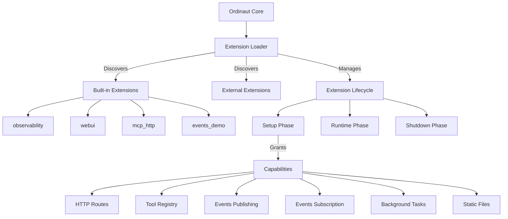

# Extension System

The Ordinaut Extension System provides a powerful and flexible framework for extending the core task scheduler functionality. Extensions allow you to add new capabilities like web interfaces, monitoring tools, protocol integrations, and custom tool implementations while maintaining clean separation from the core system.

## Architecture Overview

The extension system follows a **plugin architecture** with **capability-based security**:



## Key Features

### 🔐 **Capability-Based Security**
Extensions request specific capabilities and are only granted access to approved functionality:
- `ROUTES` - HTTP endpoint creation
- `TOOLS` - Tool registry access
- `EVENTS_PUB` - Event publishing
- `EVENTS_SUB` - Event subscription
- `BACKGROUND_TASKS` - Long-running processes
- `STATIC` - Static file serving

### 🚀 **Lazy Loading**
Extensions are loaded on-demand when first accessed, optimizing startup time and resource usage.

### 📡 **Event System**
Redis Streams-based pub/sub system enables extensions to communicate with each other.

### 🔧 **Tool Registry**
Namespaced tool registration allows extensions to provide custom tools and actions.

### 📊 **Background Tasks**
Supervisor system manages long-running background processes for extensions.

## Built-in Extensions

### observability
**Purpose**: Prometheus metrics collection and monitoring  
**Endpoint**: `/ext/observability/metrics`  
**Capabilities**: `ROUTES`

Provides comprehensive system metrics including:
- HTTP request/response metrics
- Task execution statistics  
- System resource usage
- Custom business metrics

### webui  
**Purpose**: Web-based task management interface  
**Endpoint**: `/ext/webui/`  
**Capabilities**: `ROUTES`, `STATIC`

Features:
- Task creation and management
- Pipeline execution monitoring
- Real-time system status
- Extension management interface

### mcp_http
**Purpose**: Model Context Protocol over HTTP  
**Endpoint**: `/ext/mcp_http/`  
**Capabilities**: `ROUTES`

Provides MCP-compatible HTTP endpoints for:
- Tool discovery and invocation
- Session management
- Streaming responses
- Integration with AI assistants

### events_demo
**Purpose**: Redis Streams event system demonstration  
**Endpoint**: `/ext/events_demo/`  
**Capabilities**: `ROUTES`, `EVENTS_PUB`, `EVENTS_SUB`

Demonstrates:
- Event publishing and subscription
- Inter-extension communication
- Real-time event streaming

## Creating Extensions

### Extension Structure

Every extension requires two files:

**extension.json** - Extension manifest:
```json
{
  "id": "my_extension",
  "name": "My Custom Extension", 
  "version": "1.0.0",
  "description": "Description of extension functionality",
  "module": "extension.py",
  "enabled": true,
  "eager": false,
  "grants": ["ROUTES", "TOOLS"]
}
```

**extension.py** - Extension implementation:
```python
from typing import Any, Optional
from fastapi import APIRouter, FastAPI
from ordinaut.plugins.base import Extension, ExtensionInfo, Capability

class MyExtension(Extension):
    def info(self) -> ExtensionInfo:
        return ExtensionInfo(
            id="my_extension",
            name="My Custom Extension",
            version="1.0.0",
            description="Custom functionality for Ordinaut"
        )

    def requested_capabilities(self) -> set[Capability]:
        return {Capability.ROUTES, Capability.TOOLS}

    def setup(
        self,
        *,
        app: FastAPI,
        mount_path: str,
        tool_registry: Any,
        grants: set[Capability],
        context: dict[str, Any] | None = None,
    ) -> Optional[APIRouter]:
        router = APIRouter()

        @router.get("/hello")
        def hello():
            return {"message": "Hello from my extension!"}

        # Register custom tools if TOOLS capability granted
        if Capability.TOOLS in grants:
            tool_registry.register_tool("my_tool", my_tool_function)

        return router

    async def on_startup(self, app: FastAPI) -> None:
        print("My extension starting up...")

    async def on_shutdown(self, app: FastAPI) -> None:
        print("My extension shutting down...")

def get_extension():
    return MyExtension()
```

### Extension Discovery

Extensions are discovered from multiple sources:

1. **Built-in Extensions**: `ordinaut/extensions/` directory
2. **Environment Paths**: `ORDINAUT_EXT_PATHS` environment variable
3. **Python Entry Points**: `ordinaut.plugins` entry point group

### Directory Layout

```
my_extension/
├── extension.json          # Extension manifest
├── extension.py           # Main extension code
├── static/               # Static files (if using STATIC capability)
│   ├── index.html
│   └── style.css
└── templates/            # Template files
    └── dashboard.html
```

## Extension Capabilities

### ROUTES Capability

Allows extensions to register HTTP endpoints:

```python
def setup(self, *, app: FastAPI, mount_path: str, **kwargs) -> APIRouter:
    router = APIRouter()
    
    @router.get("/status")
    def get_status():
        return {"status": "healthy"}
    
    @router.post("/action")
    async def perform_action(request: ActionRequest):
        result = await process_action(request)
        return {"result": result}
    
    return router
```

### TOOLS Capability

Enables tool registry access for custom tool registration:

```python
def setup(self, *, tool_registry: Any, grants: set[Capability], **kwargs):
    if Capability.TOOLS in grants:
        # Register a custom tool
        def my_custom_tool(input_data: dict) -> dict:
            return {"processed": True, "data": input_data}
        
        tool_registry.register_tool(
            name="ext.my_extension.custom_tool",
            func=my_custom_tool,
            schema={
                "input": {"type": "object"},
                "output": {"type": "object"}
            }
        )
```

### EVENTS_PUB/EVENTS_SUB Capabilities

Enable event publishing and subscription:

```python
def setup(self, *, context: dict[str, Any], grants: set[Capability], **kwargs):
    if Capability.EVENTS_PUB in grants or Capability.EVENTS_SUB in grants:
        events = context.get("events")
        
        if Capability.EVENTS_PUB in grants:
            # Publish events
            await events.publish("task.completed", {
                "task_id": "123",
                "status": "success"
            })
        
        if Capability.EVENTS_SUB in grants:
            # Subscribe to events
            async def handle_task_event(event_data):
                print(f"Received task event: {event_data}")
            
            await events.subscribe("task.*", handle_task_event)
```

### BACKGROUND_TASKS Capability

Manage long-running background processes:

```python
def setup(self, *, context: dict[str, Any], grants: set[Capability], **kwargs):
    if Capability.BACKGROUND_TASKS in grants:
        background = context.get("background")
        
        async def background_worker():
            while True:
                await process_background_work()
                await asyncio.sleep(60)
        
        # Start background task
        await background.start_task("my_worker", background_worker)
```

## Extension Configuration

### Environment Variables

- `ORDINAUT_EXT_PATHS` - Colon-separated paths to extension directories
- `ORDINAUT_EXT_ENTRY_GRANTS` - JSON grants configuration for entry point extensions  
- `ORDINAUT_EXT_ENTRY_EAGER` - JSON eager loading configuration
- `ORDINAUT_REQUIRE_SCOPES` - Enable scope-based authorization

### Scope-Based Authorization

Extensions can require specific scopes for access:

```bash
# Require 'ext:my_extension:routes' scope
curl -H "X-Scopes: ext:my_extension:routes" \\
     http://localhost:8080/ext/my_extension/protected
```

## Extension Lifecycle

### Discovery Phase
1. Scan `ordinaut/extensions/` for built-in extensions
2. Check `ORDINAUT_EXT_PATHS` environment variable
3. Load Python entry points from `ordinaut.plugins` group
4. Validate extension manifests against JSON schema

### Loading Phase  
1. Import extension module
2. Call `get_extension()` factory function
3. Validate extension info matches manifest
4. Grant requested capabilities based on configuration

### Setup Phase
1. Initialize extension context (tools, events, background tasks)
2. Call extension `setup()` method
3. Mount returned router with proper prefix
4. Register startup/shutdown handlers

### Runtime Phase
1. Handle HTTP requests to extension endpoints
2. Process tool invocations
3. Manage event publishing/subscription
4. Supervise background tasks

### Shutdown Phase
1. Call extension `on_shutdown()` method
2. Stop background tasks
3. Clean up resources
4. Unmount routes

## Extension Development Best Practices

### Security
- **Validate all inputs** using Pydantic models or JSON Schema
- **Use scoped permissions** appropriately
- **Sanitize outputs** to prevent injection attacks
- **Log security-relevant events** for audit trails

### Performance
- **Implement async methods** where possible
- **Use lazy loading** for expensive resources
- **Cache frequently accessed data**
- **Monitor resource usage** and implement limits

### Reliability
- **Handle errors gracefully** with proper HTTP status codes
- **Implement health checks** for background services  
- **Use exponential backoff** for retries
- **Provide meaningful error messages**

### Maintainability
- **Follow semantic versioning** for extension releases
- **Document all public APIs** with OpenAPI schemas
- **Write comprehensive tests** for extension functionality
- **Use consistent logging** with structured formats

## Testing Extensions

### Unit Testing
```python
import pytest
from fastapi.testclient import TestClient
from my_extension import get_extension

@pytest.fixture
def extension():
    return get_extension()

@pytest.fixture
def client(extension):
    app = FastAPI()
    router = extension.setup(
        app=app,
        mount_path="/test",
        tool_registry=MockToolRegistry(),
        grants={Capability.ROUTES}
    )
    app.include_router(router, prefix="/test")
    return TestClient(app)

def test_extension_endpoint(client):
    response = client.get("/test/hello")
    assert response.status_code == 200
    assert response.json() == {"message": "Hello from my extension!"}
```

### Integration Testing
```python
def test_extension_with_ordinaut():
    # Start Ordinaut with extension
    with OrdianautTestServer(extensions=["my_extension"]) as server:
        response = server.get("/ext/my_extension/hello")
        assert response.status_code == 200
```

## Extension Examples

### Simple HTTP Extension
```python
class SimpleHttpExtension(Extension):
    def info(self) -> ExtensionInfo:
        return ExtensionInfo(
            id="simple_http",
            name="Simple HTTP Extension",
            version="1.0.0"
        )

    def requested_capabilities(self) -> set[Capability]:
        return {Capability.ROUTES}

    def setup(self, **kwargs) -> APIRouter:
        router = APIRouter()
        
        @router.get("/ping")
        def ping():
            return {"pong": True}
            
        return router
```

### Tool Registry Extension
```python
class ToolExtension(Extension):
    def requested_capabilities(self) -> set[Capability]:
        return {Capability.TOOLS}

    def setup(self, *, tool_registry, **kwargs):
        def calculate_hash(data: str) -> str:
            import hashlib
            return hashlib.sha256(data.encode()).hexdigest()
        
        tool_registry.register_tool("hash.sha256", calculate_hash)
```

### Event Processing Extension  
```python
class EventExtension(Extension):
    def requested_capabilities(self) -> set[Capability]:
        return {Capability.EVENTS_SUB, Capability.EVENTS_PUB}

    def setup(self, *, context, **kwargs):
        events = context["events"]
        
        async def handle_task_completion(event_data):
            # Process completed task
            result = await process_task_result(event_data)
            
            # Publish processed result
            await events.publish("task.processed", result)
        
        # Subscribe to task completion events
        events.subscribe("task.completed", handle_task_completion)
```

## Troubleshooting

### Common Issues

**Extension not loading**
- Check extension manifest JSON syntax
- Verify `get_extension()` function exists
- Ensure extension directory is in discovery path

**Permission denied**
- Check capability grants in extension manifest
- Verify scope requirements are met
- Review extension permissions configuration

**Extension crashes**
- Check extension logs for error details
- Verify all dependencies are installed
- Test extension in isolation

### Debugging Tools

```bash
# List discovered extensions
curl http://localhost:8080/ext/status

# Check extension health
curl http://localhost:8080/ext/my_extension/health

# View extension metrics
curl http://localhost:8080/ext/observability/metrics | grep extension
```

The extension system provides a robust foundation for extending Ordinaut's capabilities while maintaining security, performance, and reliability standards.