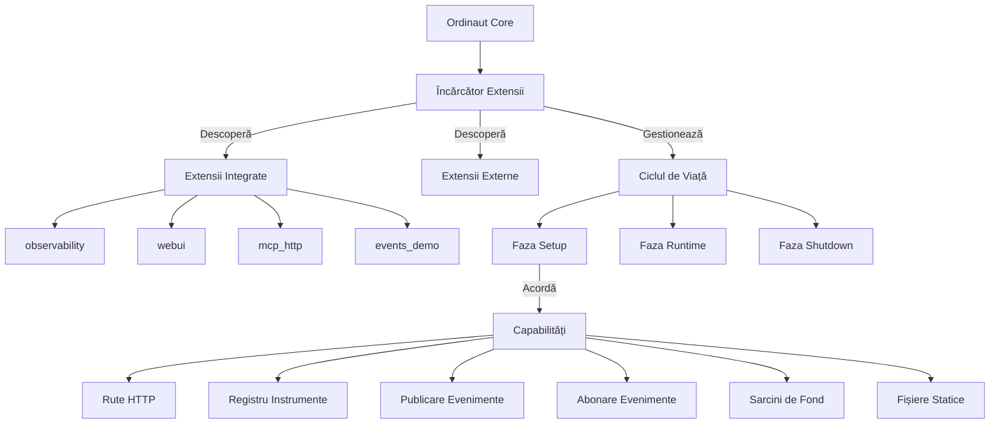

# Sistem de Extensii

Sistemul de Extensii Ordinaut oferă un cadru puternic și flexibil pentru extinderea funcționalității programatorului de sarcini de bază. Extensiile vă permit să adăugați noi capabilități precum interfețe web, instrumente de monitorizare, integrări de protocol și implementări de instrumente personalizate, menținând în același timp separarea curată de sistemul central.

## Prezentare Generală a Arhitecturii

Sistemul de extensii urmează o **arhitectură de plugin** cu **securitate bazată pe capabilități**:



## Funcționalități Cheie

### 🔐 **Securitate Bazată pe Capabilități**
Extensiile solicită capabilități specifice și li se acordă acces doar la funcționalitatea aprobată:
- `ROUTES` - Crearea punctelor finale HTTP
- `TOOLS` - Acces la registrul de instrumente
- `EVENTS_PUB` - Publicarea evenimentelor
- `EVENTS_SUB` - Abonarea la evenimente
- `BACKGROUND_TASKS` - Procese de lungă durată
- `STATIC` - Servirea fișierelor statice

### 🚀 **Încărcare Lazy**
Extensiile sunt încărcate la cerere când sunt accesate prima dată, optimizând timpul de pornire și utilizarea resurselor.

### 📡 **Sistem de Evenimente**
Sistemul pub/sub bazat pe Redis Streams permite extensiilor să comunice între ele.

### 🔧 **Registru de Instrumente**
Înregistrarea instrumentelor cu namespace permite extensiilor să furnizeze instrumente și acțiuni personalizate.

### 📊 **Sarcini de Fond**
Sistemul supervisor gestionează procesele de fond de lungă durată pentru extensii.

## Extensii Integrate

### observability
**Scop**: Colectarea metrică Prometheus și monitorizarea  
**Punct Final**: `/ext/observability/metrics`  
**Capabilități**: `ROUTES`

Furnizează metrici comprehensive de sistem incluzând:
- Metrici cerere/răspuns HTTP
- Statistici execuție sarcini
- Utilizarea resurselor sistemului
- Metrici business personalizate

### webui  
**Scop**: Interfață web de gestionare sarcini  
**Punct Final**: `/ext/webui/`  
**Capabilități**: `ROUTES`, `STATIC`

Funcționalități:
- Crearea și gestionarea sarcinilor
- Monitorizarea execuției pipeline-urilor
- Status sistem în timp real
- Interfață gestionare extensii

### mcp_http
**Scop**: Model Context Protocol peste HTTP  
**Punct Final**: `/ext/mcp_http/`  
**Capabilități**: `ROUTES`

Oferă puncte finale HTTP compatibile MCP pentru:
- Descoperirea și invocarea instrumentelor
- Gestionarea sesiunilor
- Răspunsuri streaming
- Integrare cu asistenți AI

### events_demo
**Scop**: Demonstrare sistem evenimente Redis Streams  
**Punct Final**: `/ext/events_demo/`  
**Capabilități**: `ROUTES`, `EVENTS_PUB`, `EVENTS_SUB`

Demonstrează:
- Publicarea și abonarea la evenimente
- Comunicarea inter-extensii
- Streaming evenimente în timp real

## Crearea Extensiilor

### Structura Extensiei

Fiecare extensie necesită două fișiere:

**extension.json** - Manifestul extensiei:
```json
{
  "id": "extensia_mea",
  "name": "Extensia Mea Personalizată", 
  "version": "1.0.0",
  "description": "Descrierea funcționalității extensiei",
  "module": "extension.py",
  "enabled": true,
  "eager": false,
  "grants": ["ROUTES", "TOOLS"]
}
```

**extension.py** - Implementarea extensiei:
```python
from typing import Any, Optional
from fastapi import APIRouter, FastAPI
from ordinaut.plugins.base import Extension, ExtensionInfo, Capability

class ExtensiaeMea(Extension):
    def info(self) -> ExtensionInfo:
        return ExtensionInfo(
            id="extensia_mea",
            name="Extensia Mea Personalizată",
            version="1.0.0",
            description="Funcționalitate personalizată pentru Ordinaut"
        )

    def requested_capabilities(self) -> set[Capability]:
        return {Capability.ROUTES, Capability.TOOLS}

    def setup(
        self,
        *,
        app: FastAPI,
        mount_path: str,
        tool_registry: Any,
        grants: set[Capability],
        context: dict[str, Any] | None = None,
    ) -> Optional[APIRouter]:
        router = APIRouter()

        @router.get("/salut")
        def salut():
            return {"mesaj": "Salut de la extensia mea!"}

        # Înregistrează instrumente personalizate dacă capabilitatea TOOLS e acordată
        if Capability.TOOLS in grants:
            tool_registry.register_tool("instrumentul_meu", functia_instrument)

        return router

    async def on_startup(self, app: FastAPI) -> None:
        print("Extensia mea pornește...")

    async def on_shutdown(self, app: FastAPI) -> None:
        print("Extensia mea se închide...")

def get_extension():
    return ExtensiaeMea()
```

### Descoperirea Extensiilor

Extensiile sunt descoperite din multiple surse:

1. **Extensii Integrate**: directorul `ordinaut/extensions/`
2. **Căi de Mediu**: variabila de mediu `ORDINAUT_EXT_PATHS`
3. **Puncte de Intrare Python**: grupul de puncte de intrare `ordinaut.plugins`

### Structura Directorului

```
extensia_mea/
├── extension.json          # Manifestul extensiei
├── extension.py           # Codul principal al extensiei
├── static/               # Fișiere statice (dacă folosește capabilitatea STATIC)
│   ├── index.html
│   └── style.css
└── templates/            # Fișiere șabloane
    └── dashboard.html
```

## Capabilitățile Extensiilor

### Capabilitatea ROUTES

Permite extensiilor să înregistreze puncte finale HTTP:

```python
def setup(self, *, app: FastAPI, mount_path: str, **kwargs) -> APIRouter:
    router = APIRouter()
    
    @router.get("/status")
    def get_status():
        return {"status": "sănătos"}
    
    @router.post("/actiune")
    async def executa_actiune(request: CerereActiune):
        rezultat = await proceseaza_actiune(request)
        return {"rezultat": rezultat}
    
    return router
```

### Capabilitatea TOOLS

Permite accesul la registrul de instrumente pentru înregistrarea instrumentelor personalizate:

```python
def setup(self, *, tool_registry: Any, grants: set[Capability], **kwargs):
    if Capability.TOOLS in grants:
        # Înregistrează un instrument personalizat
        def instrumentul_meu_personalizat(date_intrare: dict) -> dict:
            return {"procesat": True, "date": date_intrare}
        
        tool_registry.register_tool(
            name="ext.extensia_mea.instrument_personalizat",
            func=instrumentul_meu_personalizat,
            schema={
                "input": {"type": "object"},
                "output": {"type": "object"}
            }
        )
```

### Capabilitățile EVENTS_PUB/EVENTS_SUB

Permit publicarea și abonarea la evenimente:

```python
def setup(self, *, context: dict[str, Any], grants: set[Capability], **kwargs):
    if Capability.EVENTS_PUB in grants or Capability.EVENTS_SUB in grants:
        events = context.get("events")
        
        if Capability.EVENTS_PUB in grants:
            # Publică evenimente
            await events.publish("sarcina.completata", {
                "task_id": "123",
                "status": "succes"
            })
        
        if Capability.EVENTS_SUB in grants:
            # Abonează-te la evenimente
            async def gestioneaza_eveniment_sarcina(date_eveniment):
                print(f"Primit eveniment sarcină: {date_eveniment}")
            
            await events.subscribe("task.*", gestioneaza_eveniment_sarcina)
```

### Capabilitatea BACKGROUND_TASKS

Gestionează procesele de fond de lungă durată:

```python
def setup(self, *, context: dict[str, Any], grants: set[Capability], **kwargs):
    if Capability.BACKGROUND_TASKS in grants:
        background = context.get("background")
        
        async def worker_de_fond():
            while True:
                await proceseaza_munca_de_fond()
                await asyncio.sleep(60)
        
        # Pornește sarcina de fond
        await background.start_task("worker-ul_meu", worker_de_fond)
```

## Configurarea Extensiilor

### Variabile de Mediu

- `ORDINAUT_EXT_PATHS` - Căi separate prin două puncte către directoarele de extensii
- `ORDINAUT_EXT_ENTRY_GRANTS` - Configurația JSON grants pentru extensiile de punct de intrare  
- `ORDINAUT_EXT_ENTRY_EAGER` - Configurația JSON de încărcare eager
- `ORDINAUT_REQUIRE_SCOPES` - Activează autorizația bazată pe scope-uri

### Autorizația Bazată pe Scope-uri

Extensiile pot necesita scope-uri specifice pentru acces:

```bash
# Necesită scope-ul 'ext:extensia_mea:routes'
curl -H "X-Scopes: ext:extensia_mea:routes" \\
     http://localhost:8080/ext/extensia_mea/protejat
```

## Ciclul de Viață al Extensiei

### Faza de Descoperire
1. Scanează directorul `ordinaut/extensions/` pentru extensii integrate
2. Verifică variabila de mediu `ORDINAUT_EXT_PATHS`
3. Încarcă punctele de intrare Python din grupul `ordinaut.plugins`
4. Validează manifestele extensiilor contra schema JSON

### Faza de Încărcare  
1. Importă modulul extensiei
2. Apelează funcția factory `get_extension()`
3. Validează informațiile extensiei conform manifestului
4. Acordă capabilitățile solicitate bazate pe configurație

### Faza de Setup
1. Inițializează contextul extensiei (instrumente, evenimente, sarcini de fond)
2. Apelează metoda `setup()` a extensiei
3. Montează router-ul returnat cu prefixul corespunzător
4. Înregistrează handler-urile de pornire/oprire

### Faza de Runtime
1. Gestionează cererile HTTP către punctele finale ale extensiei
2. Procesează invocările instrumentelor
3. Gestionează publicarea/abonarea la evenimente
4. Supraveghează sarcinile de fond

### Faza de Shutdown
1. Apelează metoda `on_shutdown()` a extensiei
2. Oprește sarcinile de fond
3. Curăță resursele
4. Demontează rutele

## Cele Mai Bune Practici pentru Dezvoltarea Extensiilor

### Securitate
- **Validează toate intrările** folosind modele Pydantic sau JSON Schema
- **Folosește permisiunile cu scope** în mod corespunzător
- **Sanitizează ieșirile** pentru a preveni atacurile de injecție
- **Înregistrează evenimentele relevante pentru securitate** pentru piste de audit

### Performanță
- **Implementează metode async** unde este posibil
- **Folosește încărcarea lazy** pentru resurse costisitoare
- **Cache-uiește datele accesate frecvent**
- **Monitorizează utilizarea resurselor** și implementează limite

### Fiabilitate
- **Gestionează erorile cu grație** cu coduri de status HTTP corespunzătoare
- **Implementează verificări de sănătate** pentru serviciile de fond  
- **Folosește backoff exponențial** pentru reîncercări
- **Oferă mesaje de eroare semnificative**

### Mentenabilitate
- **Urmează versionarea semantică** pentru lansările de extensii
- **Documentează toate API-urile publice** cu scheme OpenAPI
- **Scrie teste comprehensive** pentru funcționalitatea extensiei
- **Folosește logging-ul consistent** cu formate structurate

## Testarea Extensiilor

### Testare Unit
```python
import pytest
from fastapi.testclient import TestClient
from extensia_mea import get_extension

@pytest.fixture
def extension():
    return get_extension()

@pytest.fixture
def client(extension):
    app = FastAPI()
    router = extension.setup(
        app=app,
        mount_path="/test",
        tool_registry=MockToolRegistry(),
        grants={Capability.ROUTES}
    )
    app.include_router(router, prefix="/test")
    return TestClient(app)

def test_extension_endpoint(client):
    response = client.get("/test/salut")
    assert response.status_code == 200
    assert response.json() == {"mesaj": "Salut de la extensia mea!"}
```

### Testare Integrare
```python
def test_extension_with_ordinaut():
    # Pornește Ordinaut cu extensia
    with OrdianautTestServer(extensions=["extensia_mea"]) as server:
        response = server.get("/ext/extensia_mea/salut")
        assert response.status_code == 200
```

## Exemple de Extensii

### Extensie HTTP Simplă
```python
class ExtensieHTTPSimple(Extension):
    def info(self) -> ExtensionInfo:
        return ExtensionInfo(
            id="http_simple",
            name="Extensie HTTP Simplă",
            version="1.0.0"
        )

    def requested_capabilities(self) -> set[Capability]:
        return {Capability.ROUTES}

    def setup(self, **kwargs) -> APIRouter:
        router = APIRouter()
        
        @router.get("/ping")
        def ping():
            return {"pong": True}
            
        return router
```

### Extensie Registru Instrumente
```python
class ExtensieInstrument(Extension):
    def requested_capabilities(self) -> set[Capability]:
        return {Capability.TOOLS}

    def setup(self, *, tool_registry, **kwargs):
        def calculeaza_hash(date: str) -> str:
            import hashlib
            return hashlib.sha256(date.encode()).hexdigest()
        
        tool_registry.register_tool("hash.sha256", calculeaza_hash)
```

### Extensie Procesare Evenimente  
```python
class ExtensieEveniment(Extension):
    def requested_capabilities(self) -> set[Capability]:
        return {Capability.EVENTS_SUB, Capability.EVENTS_PUB}

    def setup(self, *, context, **kwargs):
        events = context["events"]
        
        async def gestioneaza_completare_sarcina(date_eveniment):
            # Procesează sarcina completată
            rezultat = await proceseaza_rezultat_sarcina(date_eveniment)
            
            # Publică rezultatul procesat
            await events.publish("sarcina.procesata", rezultat)
        
        # Abonează-te la evenimentele de completare sarcini
        events.subscribe("sarcina.completata", gestioneaza_completare_sarcina)
```

## Depanarea

### Probleme Comune

**Extensia nu se încarcă**
- Verifică sintaxa JSON a manifestului extensiei
- Verifică că există funcția `get_extension()`
- Asigură-te că directorul extensiei este în calea de descoperire

**Acces refuzat**
- Verifică acordurile de capabilități din manifestul extensiei
- Verifică că cerințele de scope sunt îndeplinite
- Revizuiește configurația permisiunilor extensiei

**Extensia se blochează**
- Verifică log-urile extensiei pentru detalii de eroare
- Verifică că toate dependențele sunt instalate
- Testează extensia în izolare

### Instrumente de Depanare

```bash
# Listează extensiile descoperite
curl http://localhost:8080/ext/status

# Verifică sănătatea extensiei
curl http://localhost:8080/ext/extensia_mea/health

# Vezi metricile extensiei
curl http://localhost:8080/ext/observability/metrics | grep extension
```

Sistemul de extensii oferă o fundație robustă pentru extinderea capabilităților Ordinaut, menținând în același timp standardele de securitate, performanță și fiabilitate.