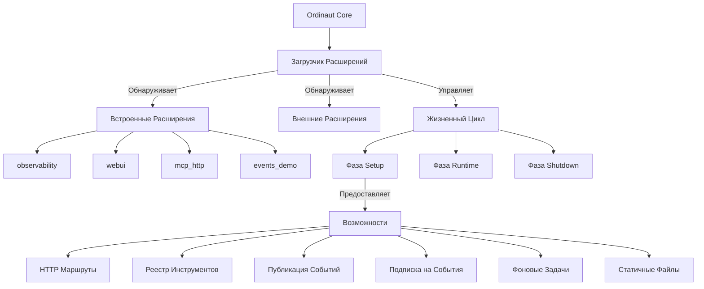

# Система Расширений

Система Расширений Ordinaut предоставляет мощную и гибкую платформу для расширения функциональности основного планировщика задач. Расширения позволяют добавлять новые возможности, такие как веб-интерфейсы, инструменты мониторинга, интеграции протоколов и пользовательские реализации инструментов, сохраняя при этом четкое разделение от основной системы.

## Обзор Архитектуры

Система расширений следует **архитектуре плагинов** с **безопасностью на основе возможностей**:



## Ключевые Особенности

### 🔐 **Безопасность на Основе Возможностей**
Расширения запрашивают специфические возможности и получают доступ только к одобренной функциональности:
- `ROUTES` - Создание HTTP конечных точек
- `TOOLS` - Доступ к реестру инструментов
- `EVENTS_PUB` - Публикация событий
- `EVENTS_SUB` - Подписка на события
- `BACKGROUND_TASKS` - Долгоработающие процессы
- `STATIC` - Обслуживание статичных файлов

### 🚀 **Ленивая Загрузка**
Расширения загружаются по требованию при первом обращении, оптимизируя время запуска и использование ресурсов.

### 📡 **Система Событий**
Система pub/sub на основе Redis Streams позволяет расширениям общаться друг с другом.

### 🔧 **Реестр Инструментов**
Регистрация инструментов с пространством имен позволяет расширениям предоставлять пользовательские инструменты и действия.

### 📊 **Фоновые Задачи**
Система супервизора управляет долгоработающими фоновыми процессами для расширений.

## Встроенные Расширения

### observability
**Назначение**: Сбор метрик Prometheus и мониторинг  
**Конечная Точка**: `/ext/observability/metrics`  
**Возможности**: `ROUTES`

Предоставляет комплексные системные метрики включая:
- Метрики HTTP запросов/ответов
- Статистику выполнения задач
- Использование системных ресурсов
- Пользовательские бизнес-метрики

### webui  
**Назначение**: Веб-интерфейс управления задачами  
**Конечная Точка**: `/ext/webui/`  
**Возможности**: `ROUTES`, `STATIC`

Возможности:
- Создание и управление задачами
- Мониторинг выполнения pipeline
- Статус системы в реальном времени
- Интерфейс управления расширениями

### mcp_http
**Назначение**: Model Context Protocol через HTTP  
**Конечная Точка**: `/ext/mcp_http/`  
**Возможности**: `ROUTES`

Предоставляет HTTP конечные точки совместимые с MCP для:
- Обнаружения и вызова инструментов
- Управления сессиями
- Потоковых ответов
- Интеграции с AI ассистентами

### events_demo
**Назначение**: Демонстрация системы событий Redis Streams  
**Конечная Точка**: `/ext/events_demo/`  
**Возможности**: `ROUTES`, `EVENTS_PUB`, `EVENTS_SUB`

Демонстрирует:
- Публикацию и подписку на события
- Межрасширенческое общение
- Потоковую передачу событий в реальном времени

## Создание Расширений

### Структура Расширения

Каждое расширение требует два файла:

**extension.json** - Манифест расширения:
```json
{
  "id": "мое_расширение",
  "name": "Мое Пользовательское Расширение", 
  "version": "1.0.0",
  "description": "Описание функциональности расширения",
  "module": "extension.py",
  "enabled": true,
  "eager": false,
  "grants": ["ROUTES", "TOOLS"]
}
```

**extension.py** - Реализация расширения:
```python
from typing import Any, Optional
from fastapi import APIRouter, FastAPI
from ordinaut.plugins.base import Extension, ExtensionInfo, Capability

class МоеРасширение(Extension):
    def info(self) -> ExtensionInfo:
        return ExtensionInfo(
            id="мое_расширение",
            name="Мое Пользовательское Расширение",
            version="1.0.0",
            description="Пользовательская функциональность для Ordinaut"
        )

    def requested_capabilities(self) -> set[Capability]:
        return {Capability.ROUTES, Capability.TOOLS}

    def setup(
        self,
        *,
        app: FastAPI,
        mount_path: str,
        tool_registry: Any,
        grants: set[Capability],
        context: dict[str, Any] | None = None,
    ) -> Optional[APIRouter]:
        router = APIRouter()

        @router.get("/привет")
        def привет():
            return {"сообщение": "Привет от моего расширения!"}

        # Регистрирует пользовательские инструменты если предоставлена возможность TOOLS
        if Capability.TOOLS in grants:
            tool_registry.register_tool("мой_инструмент", функция_инструмента)

        return router

    async def on_startup(self, app: FastAPI) -> None:
        print("Мое расширение запускается...")

    async def on_shutdown(self, app: FastAPI) -> None:
        print("Мое расширение завершается...")

def get_extension():
    return МоеРасширение()
```

### Обнаружение Расширений

Расширения обнаруживаются из нескольких источников:

1. **Встроенные Расширения**: директория `ordinaut/extensions/`
2. **Переменные Окружения**: переменная окружения `ORDINAUT_EXT_PATHS`
3. **Python Entry Points**: группа entry point `ordinaut.plugins`

### Структура Директории

```
мое_расширение/
├── extension.json          # Манифест расширения
├── extension.py           # Основной код расширения
├── static/               # Статичные файлы (при использовании возможности STATIC)
│   ├── index.html
│   └── style.css
└── templates/            # Файлы шаблонов
    └── dashboard.html
```

## Возможности Расширений

### Возможность ROUTES

Позволяет расширениям регистрировать HTTP конечные точки:

```python
def setup(self, *, app: FastAPI, mount_path: str, **kwargs) -> APIRouter:
    router = APIRouter()
    
    @router.get("/статус")
    def get_status():
        return {"статус": "здоровый"}
    
    @router.post("/действие")
    async def выполнить_действие(request: ЗапросДействия):
        результат = await обработать_действие(request)
        return {"результат": результат}
    
    return router
```

### Возможность TOOLS

Обеспечивает доступ к реестру инструментов для регистрации пользовательских инструментов:

```python
def setup(self, *, tool_registry: Any, grants: set[Capability], **kwargs):
    if Capability.TOOLS in grants:
        # Регистрирует пользовательский инструмент
        def мой_пользовательский_инструмент(входные_данные: dict) -> dict:
            return {"обработано": True, "данные": входные_данные}
        
        tool_registry.register_tool(
            name="ext.мое_расширение.пользовательский_инструмент",
            func=мой_пользовательский_инструмент,
            schema={
                "input": {"type": "object"},
                "output": {"type": "object"}
            }
        )
```

### Возможности EVENTS_PUB/EVENTS_SUB

Включают публикацию и подписку на события:

```python
def setup(self, *, context: dict[str, Any], grants: set[Capability], **kwargs):
    if Capability.EVENTS_PUB in grants or Capability.EVENTS_SUB in grants:
        events = context.get("events")
        
        if Capability.EVENTS_PUB in grants:
            # Публикует события
            await events.publish("задача.завершена", {
                "task_id": "123",
                "статус": "успех"
            })
        
        if Capability.EVENTS_SUB in grants:
            # Подписывается на события
            async def обработать_событие_задачи(данные_события):
                print(f"Получено событие задачи: {данные_события}")
            
            await events.subscribe("task.*", обработать_событие_задачи)
```

### Возможность BACKGROUND_TASKS

Управляет долгоработающими фоновыми процессами:

```python
def setup(self, *, context: dict[str, Any], grants: set[Capability], **kwargs):
    if Capability.BACKGROUND_TASKS in grants:
        background = context.get("background")
        
        async def фоновый_работник():
            while True:
                await обработать_фоновую_работу()
                await asyncio.sleep(60)
        
        # Запускает фоновую задачу
        await background.start_task("мой_работник", фоновый_работник)
```

## Конфигурация Расширений

### Переменные Окружения

- `ORDINAUT_EXT_PATHS` - Пути к директориям расширений разделенные двоеточием
- `ORDINAUT_EXT_ENTRY_GRANTS` - JSON конфигурация предоставлений для entry point расширений  
- `ORDINAUT_EXT_ENTRY_EAGER` - JSON конфигурация активной загрузки
- `ORDINAUT_REQUIRE_SCOPES` - Включает авторизацию на основе областей

### Авторизация на Основе Областей

Расширения могут требовать специфические области для доступа:

```bash
# Требует область 'ext:мое_расширение:routes'
curl -H "X-Scopes: ext:мое_расширение:routes" \\
     http://localhost:8080/ext/мое_расширение/защищенный
```

## Жизненный Цикл Расширения

### Фаза Обнаружения
1. Сканирует директорию `ordinaut/extensions/` для встроенных расширений
2. Проверяет переменную окружения `ORDINAUT_EXT_PATHS`
3. Загружает Python entry points из группы `ordinaut.plugins`
4. Валидирует манифесты расширений против JSON схемы

### Фаза Загрузки  
1. Импортирует модуль расширения
2. Вызывает фабричную функцию `get_extension()`
3. Валидирует информацию расширения соответствующую манифесту
4. Предоставляет запрошенные возможности на основе конфигурации

### Фаза Настройки
1. Инициализирует контекст расширения (инструменты, события, фоновые задачи)
2. Вызывает метод `setup()` расширения
3. Монтирует возвращаемый маршрутизатор с соответствующим префиксом
4. Регистрирует обработчики запуска/завершения

### Фаза Выполнения
1. Обрабатывает HTTP запросы к конечным точкам расширения
2. Обрабатывает вызовы инструментов
3. Управляет публикацией/подпиской на события
4. Контролирует фоновые задачи

### Фаза Завершения
1. Вызывает метод `on_shutdown()` расширения
2. Останавливает фоновые задачи
3. Очищает ресурсы
4. Отмонтирует маршруты

## Лучшие Практики Разработки Расширений

### Безопасность
- **Валидируйте все входные данные** используя модели Pydantic или JSON Schema
- **Используйте области разрешений** соответственно
- **Санитизируйте выходные данные** для предотвращения инъекционных атак
- **Записывайте события связанные с безопасностью** для аудиторских следов

### Производительность
- **Реализуйте async методы** где возможно
- **Используйте ленивую загрузку** для дорогих ресурсов
- **Кешируйте часто используемые данные**
- **Мониторьте использование ресурсов** и реализуйте лимиты

### Надежность
- **Обрабатывайте ошибки грациозно** с соответствующими HTTP статус кодами
- **Реализуйте проверки здоровья** для фоновых сервисов  
- **Используйте экспоненциальный откат** для повторов
- **Предоставляйте осмысленные сообщения об ошибках**

### Сопровождаемость
- **Следуйте семантическому версионированию** для релизов расширений
- **Документируйте все публичные API** с OpenAPI схемами
- **Пишите комплексные тесты** для функциональности расширений
- **Используйте согласованное логирование** со структурированными форматами

## Тестирование Расширений

### Модульное Тестирование
```python
import pytest
from fastapi.testclient import TestClient
from мое_расширение import get_extension

@pytest.fixture
def extension():
    return get_extension()

@pytest.fixture
def client(extension):
    app = FastAPI()
    router = extension.setup(
        app=app,
        mount_path="/test",
        tool_registry=MockToolRegistry(),
        grants={Capability.ROUTES}
    )
    app.include_router(router, prefix="/test")
    return TestClient(app)

def test_extension_endpoint(client):
    response = client.get("/test/привет")
    assert response.status_code == 200
    assert response.json() == {"сообщение": "Привет от моего расширения!"}
```

### Интеграционное Тестирование
```python
def test_extension_with_ordinaut():
    # Запускает Ordinaut с расширением
    with OrdianautTestServer(extensions=["мое_расширение"]) as server:
        response = server.get("/ext/мое_расширение/привет")
        assert response.status_code == 200
```

## Примеры Расширений

### Простое HTTP Расширение
```python
class ПростоеHTTPРасширение(Extension):
    def info(self) -> ExtensionInfo:
        return ExtensionInfo(
            id="простое_http",
            name="Простое HTTP Расширение",
            version="1.0.0"
        )

    def requested_capabilities(self) -> set[Capability]:
        return {Capability.ROUTES}

    def setup(self, **kwargs) -> APIRouter:
        router = APIRouter()
        
        @router.get("/пинг")
        def пинг():
            return {"понг": True}
            
        return router
```

### Расширение Реестра Инструментов
```python
class РасширениеИнструмента(Extension):
    def requested_capabilities(self) -> set[Capability]:
        return {Capability.TOOLS}

    def setup(self, *, tool_registry, **kwargs):
        def вычислить_хеш(данные: str) -> str:
            import hashlib
            return hashlib.sha256(данные.encode()).hexdigest()
        
        tool_registry.register_tool("hash.sha256", вычислить_хеш)
```

### Расширение Обработки Событий  
```python
class РасширениеСобытия(Extension):
    def requested_capabilities(self) -> set[Capability]:
        return {Capability.EVENTS_SUB, Capability.EVENTS_PUB}

    def setup(self, *, context, **kwargs):
        events = context["events"]
        
        async def обработать_завершение_задачи(данные_события):
            # Обрабатывает завершенную задачу
            результат = await обработать_результат_задачи(данные_события)
            
            # Публикует обработанный результат
            await events.publish("задача.обработана", результат)
        
        # Подписывается на события завершения задач
        events.subscribe("задача.завершена", обработать_завершение_задачи)
```

## Устранение Неполадок

### Общие Проблемы

**Расширение не загружается**
- Проверьте JSON синтаксис манифеста расширения
- Убедитесь что функция `get_extension()` существует
- Убедитесь что директория расширения в пути обнаружения

**Доступ запрещен**
- Проверьте предоставления возможностей в манифесте расширения
- Убедитесь что требования областей выполнены
- Проверьте конфигурацию разрешений расширения

**Расширение падает**
- Проверьте логи расширения для деталей ошибки
- Убедитесь что все зависимости установлены
- Протестируйте расширение в изоляции

### Инструменты Отладки

```bash
# Список обнаруженных расширений
curl http://localhost:8080/ext/status

# Проверить здоровье расширения
curl http://localhost:8080/ext/мое_расширение/health

# Посмотреть метрики расширения
curl http://localhost:8080/ext/observability/metrics | grep extension
```

Система расширений предоставляет надежную основу для расширения возможностей Ordinaut, сохраняя при этом стандарты безопасности, производительности и надежности.